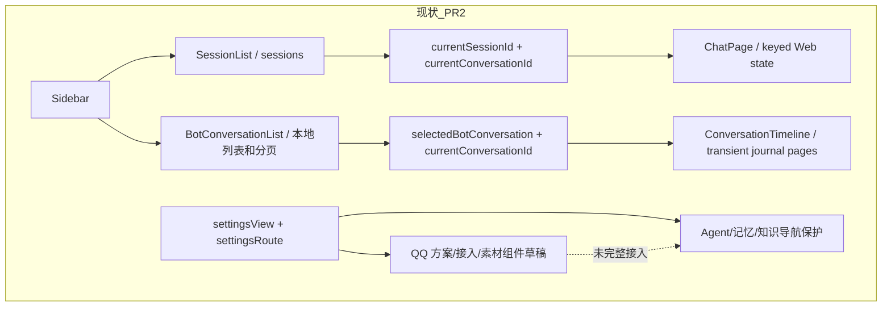
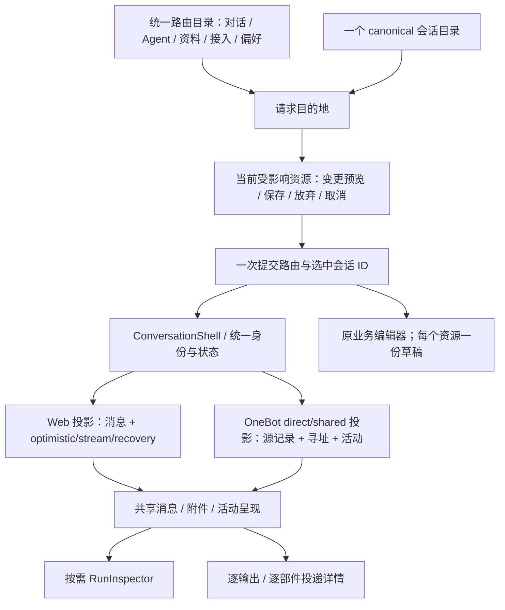

# PR 3 前端：统一会话、群聊活动与完整设置迁移

> 设计日期：2026-09-26。源码基线：PR 2 前端 `e0aa84b`，集成工作树 `4216f4f`。本文在 PR 3 组件实现前编写；描述拟实现行为，不表示已经通过浏览器或真实 OneBot 验收。
>
> 依据：[总体前端决策](/Users/nkanf/docs/superstring/refactor/09-前端体验与架构.md)、[逐文件实施计划](/Users/nkanf/docs/superstring/refactor/07-逐文件实施计划.md)、[PR 1 功能清单](./frontend-refactor-design.md)、[PR 2 设计与恢复语义](./frontend-conversation-design.md)。**所有现有功能、字段、作用域、编辑交互和错误恢复都必须保留，可以增强，不能简化。**

## 1. 本轮解决的实际结构问题

PR 2 已经实现按 canonical conversation ID 隔离 Web 请求、运行事件 reducer、断流只读对账和 OneBot 私聊记录。PR 3 接着完成目录、选择、呈现和设置资源的统一。





这次统一的对象是会话身份、事件关联、导航提交和公共呈现。Web 消息操作与平台只读记录仍保持各自真实能力；不能为了复用一个列表而删除 Web 的乐观消息、失败残文、重试、逐条删除或用量信息。

## 2. 组件与依赖决策

**现状：** React、Zustand、Radix Dialog/Alert Dialog 已在项目中使用，PR 2 的 `eventsource-parser` 处理 SSE 分帧。现有样式变量、双语言、主题与原生表单都可继续使用。

**改动：** 导航与列表使用原生 `nav/list/button`；活动、来源和变更预览使用 `details/summary`；移动导航和运行详情用 Radix Dialog；保存/放弃/取消用现有 Radix Alert Dialog。若会话菜单迁移组件，则使用 Radix Context Menu/Dropdown Menu，保留键盘、定位、重命名及 IME 行为。配置正文继续按标题和锚点完整展开，只有详情/预览可折叠。

**预期：** 应用只实现领域行为，不重新编写焦点约束、portal 或菜单键盘管理。本轮没有需要额外 Effect/Motion 的行为，不增加另一套状态库或视觉套件。

实施前已核对官方 [Radix Dialog](https://www.radix-ui.com/primitives/docs/components/dialog)、[Alert Dialog](https://www.radix-ui.com/primitives/docs/components/alert-dialog) 和 [WAI Disclosure](https://www.w3.org/WAI/ARIA/apg/patterns/disclosure/) 文档。Dialog 负责焦点和模态语义；业务保存成功后再关闭。普通导航不伪装成需要方向键切换的 tablist。

## 3. 一个目录和一个选择来源

### 3.1 状态与身份

**现状：** Web `sessions` 与 `BotConversationList` 本地列表分别加载；选择同时可写 `currentSessionId/currentConversationId/selectedBotConversation`。两条列表的刷新、分页、选中逻辑各自维护。

**改动：** 新增轻量 conversation directory slice：`summaryById` 保存 canonical 元数据；`directoryIds/cursor/loading/error/readRevision` 管目录加载；唯一可写选择为 `currentConversationId`。`selectedConversation`、Web 的当前 session ID 都是 selector。`sessionConversationIds` 可作为来源查询索引，不作为选择状态。删除 `selectedBotConversation` 和 `currentSessionId` 的可写状态，迁移全部消费者。

`conversationById` 继续存 Web 请求、输入草稿、用量和消息；`runById` 继续存运行元数据。OneBot 原文仍在可见时间线的短期查询结果里，不塞进永久目录、不写浏览器持久化。目录排序/列表请求有 revision，晚到的请求不能复活删除项或覆盖新名称。

Web 原 `SessionResponse` 若仍被某个管理 API 使用，只作为那个请求的完整资源快照；目录与选择不能继续依赖它作为第二份权威列表。需要菜单的信息由 summary/明确源查询提供。保留旧浏览器 `superstring-session` 的恢复能力：启动时按 sourceId 解析 canonical ID，随后使用唯一选择。迁移失败明确报读取失败，不凭空创建另一份会话。

### 3.2 目录交互

显示同一个列表，标题下用短标识区分 `Web · 私聊`、`OneBot · 私聊`、`OneBot · 群聊`，按服务端顺序分页。初始加载、空、失败、加载更多都有独立状态。Web 保留新建默认名/自定义名、Agent 选择、重命名、刷新、删除及所有确认；OneBot 条目只提供查看与接入配置入口，不显示无效 Web 操作。

后台会话持续运行时，切换其他条目只改变选择；每项只订阅自己的运行相位，避免每个 delta 刷整列。可见条目的刷新错误保留元数据与明确错误，来源正文的保留处理仍走时间线规则。

**后端前置条件：** `GET /v2/conversations` 必须列出所有旧 Web session，包括空会话、刚创建会话和从未被 canonical lookup 的历史会话；同时启用 OneBot shared。不能靠“用户点过才出现”完成目录迁移。新增/改名后按 `channel=web&sourceId=` 查询 summary；删除成功更新目录。未观察过的手工 OneBot 绑定继续在接入页存在，不伪造一条聊天消息。

## 4. ConversationShell 与群聊时间线

### 4.1 公共壳和消息能力

**现状：** `App` 根据 `selectedBotConversation` 分派两种不同顶层页面；OneBot 页面标题写死“私聊”，已有来源状态、媒体修订和送达详情，但没有完整群聊寻址与唤醒状态。

**改动：** `ConversationShell` 统一标题、Agent、渠道、参与者、读取状态和运行入口，按 summary 的 channel/topology 组合内容。抽出小型公共消息头/正文/附件/状态呈现；Web 消息数据仍来自原 `listMessages` 加 keyed SSE state，OneBot 来自 source-backed events。两种投影输出的公共展示字段可复用，Web 独有操作仍交给其 action 区，不重新创造一个通用业务消息 store。

Web 输入框保留 Enter/Shift+Enter/IME、草稿、清空/发送、同请求重试、知识权限变更确认和完整 ContextUsagePanel。OneBot direct/shared 均只读，页尾说明通过所连平台发言；不添加会发出平台副作用的伪“回复”按钮。

### 4.2 群成员、寻址和来源

群消息每条显示实际 `participant.id/label/role`；同名成员仍可用 ID 区分，ID 放详情或紧邻副标识，不能只靠颜色。`addressing.reasons` 区分 @、回复助手、私聊与历史 addressed；`legacy_addressed` 只说历史记录标记为面向助手，不推断当时真的 @。`mentionIds` 展示目标；`replyTo.sourceId` 关联已加载原记录，未加载/已过期只显示来源引用，不捏造原文。

顺序以 conversation-local seq 为准，时间用于显示。源记录修订继续按 `source.kind + source.id` 归并，媒体描述修订附到原消息，输出送达修订按 outputId 更新；run seq 是另一个序列。保留失败/取消的消息状态，不把空投影当空白原消息。

### 4.3 活动状态的证据

活动与普通消息分开：普通消息是收到的消息和确认发送的消息；唤醒、无输出、正在投递和错误是紧凑活动行。详情可看来源、目标、run 和逐部件结果。普通界面不展示 leaseToken/seq 等内部术语；高级来源详情可查 ID。

| 界面状态 | 必需的真实证据 | 不允许的推断 |
| --- | --- | --- |
| 等待处理 | wake pending/readyAt | 不能只用 lastSeq 大于 consumedSeq 推断排队 |
| 正在准备 / 正在理解图片 / 正在回复 | run snapshot 与当前 step phase | leaf 维护不叫“正在回复” |
| 本次未发言 | wake/run 的 no_output 终态 | 不造空 assistant 消息；不能把没有输出等同 no_output |
| 正在送达 | delivery planned/delivering 或 part sending | run completed 不等于已送达 |
| 已送达 | 对应 output/parts 的 confirmed | 不能一个 target 成功就宣称全部成功 |
| 部分送达 | 确认成功的部件与失败/未发送部件同时存在 | 保留文字成功、表情失败两件事实 |
| 发送结果待确认 | output/part unknown | 没有普通“重发”按钮；只读刷新 |
| 已过期 / 失败 | stale / failed 事实与 errorCode | 不解释成某个推测的业务原因 |

同一 run 的多个 output 按 ordinal 分组，每个组保留自己的 target、text/sticker parts 和平台 message ID。没有 target 数据时写“目标信息未记录”，不能从文本中的 @ 拆目标。

### 4.4 缓存与可见性

沿用 PR 2 `use-conversation-events` 的保留期策略：只在可见/前台刷新，隐藏/失焦清除正文并中止读取；恢复时从第一页重新校验已加载范围。来源保留期变化不一定产生新 seq，不能只增量追加。失败重读保留位置/元数据，正文标未能重新确认。轮询周期是显式参数，不与服务端 WakeScheduler 的周期混用。

## 5. 群聊视图需要的最小共享合同补充

由 root/后端统一维护 Zod schema，前端不定义另一份 wire DTO，也不访问内部数据库。

1. **目录完备性**：上一节全部 Web + OneBot direct/shared；保持 `{items,nextCursor}`。
2. **唤醒投影**：给 wake 活动增加可空的窄投影（建议 `wake: {id,cause,status,readyAt,errorCode} | null`），runId 复用现有 event 字段。不要返回 leaseToken；历史事实缺失用 null。状态改变需要 activity revision 或刷新能取得当前状态。
3. **输出受众**：Delivery 增可空 target 投影（群/私聊目标及可选 participant IDs）；实际编码由后端现有输出计划决定，前端只展示。不能把群ID误标成成员ID。
4. **运行关联**：wake/run 的 no_output、active、failed 能经事件 runId + `GET /v2/runs/:id` 查询。需要批量状态时先复用已加载 run cache，避免为每条历史行固定轮询一次；当前活动按需刷新。
5. **旧诊断到新调度的映射**：当前 `QqStorageSettings` 的 candidate/lease/idle verdict 字段需由后端给等价真实投影或明确新增 scheduler 字段。若字段含义变更，连同 label 和测试更新；禁止旧数字改名后冒充新运行数。

空字段是“不知道/未记录”。接口不可用显示读错误，不能前端合成成功。精确上下文仍只在手动 RunInspector 请求中出现。

## 6. 一份导航目录与明确的设置作用域

**现状：** `SettingsSidebar` 通过 group/view/route 多处分支组织人设、记忆、快捷管理；QQ 全局资源混在“人设”里，运行模式中包含接入。`models` 是一个有多个独立保存组的混合作用域页面。

**改动：** 一个声明式路由目录负责 top-level group、label、scope 和页面落点；应用壳、侧栏、返回/别名都由它派生。一级导航为 对话 / Agent / 资料 / 接入 / 偏好。旧业务组件重组，不复制表单。原设置中心入口保留为导航概览/别名；新导航不另开一套写状态。

| 旧入口 | 新位置 | 必须保留 |
| --- | --- | --- |
| chat、Web sessions、OneBot direct list | 对话 | 完整 Web 操作和 direct/shared 来源记录 |
| agents、basic | Agent → 助手管理 | 新建、启停、默认新会话 Agent、批量选择/删除、名称说明 |
| models、management、knowledge-model | Agent → 模型用途 | 所有独立保存组、四类 Agent 文本模型、全局整理/QQ判断/图片/转写、可用性和一键覆盖 |
| external-api | Agent → 模型服务 | endpoint、认证、模型容量、检测和移除；仍全局 |
| identity、expression、emotion | Agent → 身份与表达 / 情绪 | 全部人设指令/强度；情绪未开放说明 |
| context | Agent → 上下文 | 容量、输出、压缩、摘要读取、近历史、超时配置 |
| long-memory | 资料 → 长期记忆 | 全部读取模式、范围、整理、搜索分页、合并/屏蔽/启用/永久删除/纠正 |
| knowledge-config、knowledge view | 资料 → 知识库 | 分类、文件/粘贴导入、全文与整理稿、版本、权限、批量授权、预算/模型/规则 |
| profile | 资料 → 用户画像 | 原未开放入口和说明 |
| operating-mode | 接入 → 运行模式与连接 | 对话模式、未开放任务模式、外部聊天总开关、OneBot连接和完整绑定 |
| qq-scheme-config | 接入 → 唤醒与发言方案 | 所有方案字段与提示词、完整变更预览 |
| qq-stickers | 接入 → 表情素材 | 导入/说明/集合/批量/启停/影响范围 |
| qq-storage | 接入 → 活动与存储 | 真实用量/调度/媒体/过期清理 |
| general、appearance | 偏好 | 语言、主题、浏览器保存失败提示、桌面关闭行为与生命周期 |

全局页面没有会误导用户的 Agent 选择器。模型混合页面按组标明作用域：全局 QQ 判断模型按实际绑定 Agent 回退；全局知识整理与 Agent 自定义各自保存；方案提示词归方案。设置中的 Agent 切换不改当前聊天绑定或新会话默认 Agent。

## 7. 资源草稿与导航事务

### 7.1 当前缺口

- `SessionList` / `BotConversationList` 先修改选中会话再调用 `openChat()`；取消设置离开后，底层选择已经改变。
- `App.beforeunload` 只覆盖原 Agent/知识/纠正草稿，QQ scheme/sticker/access 草稿和 QQ 自动整理条数没有统一纳入。
- `SchemeSettings` 资源 draft 在 store，数字 raw text/invalid 在组件内；离开页面会丢非法但未保存输入。
- `QqAppAccess` 的连接、手动绑定、改绑、重要人物名单在组件内；设置刷新可覆盖未提交连接值。
- 表情 editor 已在 store，但集合名/批量输入仍在组件内；重新 load 时不能替换正在编辑的资源。

### 7.2 行为与数据归属

每种资源只有一份草稿，业务 API 与 expected revision 留在现有 actions。新增有限、显式的草稿查询/保存协调函数，列出当前离开将受影响的资源；不建可注册 provider 框架，不把所有表单序列化成通用 JSON 编辑器。

`PendingNavigation` 包含完整目的地（route/view，或 conversationId，或 Agent/方案 ID）。点击只提交 intention；save/discard 成功后才一起提交 route 和 selection。取消保持旧 route、selected ID、输入、焦点。Web composer 是随会话保留的输入，不因切换而触发设置保存。

```text
request(destination)
  → affected dirty resources = current drafts whose ownership will change/unmount
  → none: commit destination
  → some: preview names/field diffs → Save / Discard / Cancel
       Save: validate raw inputs → call existing saves → all successful → commit
             partial failure: keep successes; keep failed/unsaved drafts; remain here
       Discard: restore saved resource snapshots → commit
       Cancel: close confirmation, keep all state and original destination selection
```

保存中的资源不能重复提交，其他无关请求/会话不全局锁死。确认弹层列实际资源名与改动数，token 只显示“替换/清除/不变”，不显示明文差异。部分保存不是事务回滚；界面准确说明已保存哪些、哪些仍未完成。revision 冲突保留用户输入并展示服务端拒绝，不静默覆盖。

### 7.3 各资源策略

| 资源 | 草稿放置 | 离开/保存行为 |
| --- | --- | --- |
| Agent/人设/知识/记忆 | 原 slice | 原语义完整保留，接入统一 affected-resources 计算 |
| QQ scheme | scheme editor 加 raw number text/validation | 保存 whole resource；越界不夹紧、不写成合法旧值；字段标记/预览/底部保存条保留 |
| 连接 | access draft，含 base revision | endpoint/account/token replacement 与当前设置分离；refresh 更新 source 不覆盖已改 draft；token 仅内存，保存/放弃后清除 |
| 手动绑定 | access draft | kind/号码/Agent/方案保持；Save 的含义是明确“创建该绑定”，预览写清；空白未操作表单不算 dirty |
| 改绑/重要人物 | binding ID keyed draft | 基于当前有效 Agent/方案补另一个字段；名单 mode+members 整组保存；未观察绑定仍可编辑 |
| 自动整理条数 | 原 qqMemoryBatchDrafts | 空白保存为 null（关闭），保持 revision；与接入/记忆页共享一份 |
| 表情说明 | 原 sticker editor | 保存内容与启用分开；生成说明/标签仍是草稿，导航不自动启用 |
| 集合重命名/批量输入 | sticker UI draft | 未提交文字可保留；离开若要清除则进入 guard。仅选中若干素材不是已修改内容，不误弹保存 |

触发/暂停/总开关等原即时保存控件继续即时保存；不要偷偷改成要第二次点保存。它们已有的 compare-and-swap 不属于待保存草稿。浏览器 beforeunload 与应用导航使用同一个 dirty 查询，避免两份列表漂移。

## 8. QQ 方案完整字段映射与交互

**现状：** 一个方案保存 `name/description/triggers/rhythm/context/outputReserve/stickers/stickerCollectionIds/prompts/reply`，带 source.revision。五个 prompt 可编辑，第六个回复 prompt 由 `reply.split_by_speaker` 派生只读。

**改动：** 保持一个 scheme editor 和一份保存 payload，用更清楚的连续分区组织，分区是导航锚点，不拆成互相不同步的草稿。

| 新分区 | 原字段/能力逐项保留 | 语义约束 |
| --- | --- | --- |
| 方案 | 名称、说明、新建、另存为、选择、删除、使用此方案的绑定数 | 新建默认四触发关闭；另存为保存当前 draft；有草稿/非法输入时先确认 |
| 何时观察与发言 | triggers.direct_reply/follow_up/chiming_in/idle_topic | 直接/跟进原不受节奏门槛；主动/冷场适用各自门槛，不能用单个“主动”开关替代 |
| 发言节奏 | initiative_min_score、merge_window_seconds、reply_cooldown_seconds、hourly_speech_limit、idle_quiet_minutes、max_recompute_count | 原数值可编辑；后端确认新 loop 对应语义后再更新解释；不能因删除旧 pipeline 顺手丢字段 |
| 允许时段 | active_hours_enabled/start/end | 本地时间选择器与 UTC minute-of-day 换算保留，跨午夜/开始等于结束行为保留 |
| 上下文与模型资源 | judgement/reply 的 message_limit、window_minutes、token_budget；judgement/reply_output_reserved | 现页面预算单位为估算字节，不能擅自改叫 token；保留两个配置用途到后端明确映射 |
| 模型/记忆/知识说明 | 原全局用途模型链接、绑定 Agent 读取规则/授权/预算入口 | 不在方案复制模型字段；知识文案随真实 backend 接入能力更新 |
| 输出与受众 | reply.split_by_speaker；派生只读回复任务 | 保留多人目标、一人多条和预览；不把派生只读文本改成不可保存的假编辑器 |
| 媒体与表情 | max_sticker_count、sticker_min_repeat_minutes、sticker_recent_avoid_count、media_supplement_window_minutes、media_frame_count、media_max_dimension、stickerCollectionIds | 硬重复间隔与软避让区别保留；集合整集授权；等待/抽帧/尺寸配置保留 |
| 可编辑提示词 | scene、judge、review、sticker、media | 五份实际保存；后端把 judge/review 映射主 Agent 决策/新事实复看时仍保留用户文本与来源 |

用户输入数字时先存 raw text，blur 校验；非法数字阻止保存但不强制归零/夹紧。变更预览显示 before/after，分组/就地标记与底部保存/放弃条保留。切方案/新建/另存为/删除和离开页面共用一条待处理 intention，避免双确认或先丢草稿。

## 9. 接入、表情、存储能力清单

### 9.1 OneBot 接入

保留助手账号、WebSocket endpoint、只写 token（不读取旧值，替换/清除明确）、总开关、传输阶段/错误、刷新；接入说明区分 OneBot v11 协议与 QQ 适配，不虚构直接 QQ 协议实现。连接与绑定在同一资源 workspace 的不同锚点显示，不能同时 mount 两个各自有 draft 的 `QqAppAccess`。

绑定列表是已观察会话与所有绑定的并集；支持未说过话的群/私聊按号码绑定。保留 Agent/方案改绑、四 trigger 的继承/null/on/off、暂停/恢复、重要人物 off/soft/hard 和完整 ID 文本。soft 影响上下文显著性；hard 的受众资格语义以现后端保留，名单外消息仍记录。自动整理条数 null/正整数、立即整理、pending 数和 queued/nothing/switch_off/paused/busy/agent_disabled 结果保留。

### 9.2 表情素材

导入 PNG/JPEG/GIF/WebP/BMP 和每种拒绝原因保留；导入默认停用。列表用 still 预览，详情保留 GIF 动态原图；名称、说明、标签、usageNote、集合归属完整可编辑。保存整理不启用；保存并启用是独立显式动作。生成说明/标签只写 draft，缺模型错误仍解释原因。

集合创建/重命名及 revision、批量选择/加减集合/加减标签/启停、停用确认、方案影响范围保留；不添加后端没有的删除/替换能力。素材选择与未提交文字分别记录，单纯选择不会误触发保存动作。

### 9.3 活动与存储

保留 observation 的消息/文本/过期文本、speech records/text、send attempts/parts、昵称有效/过期、素材数量/启用数/字节/集合；媒体总段数/已说明/待处理；调度排队/ready/lease 和每绑定 idle verdict/时刻/readyAt/last observed 读取能力。

原不发言原因 feature_off、conversation_paused、trigger_off、no_member_baseline、awaiting_reply、not_quiet_yet、cooling_down、hourly_limit、outside_active_hours、candidate_pending、already_judged 全部有对应解释；若新调度使用新字段，用正式映射替代，不能丢可诊断能力。没有记录与没有后端数据都明确显示，不用 0 伪装。

保留服务端保留天数与“只清理过期内容”，结果显示各类 removed 计数并重读用量。素材不纳入该清理；原始媒体未本地缓存、无单独失败导出等真实限制说明保留。旧“全局只有一条模型链”仅在事实仍成立时保留，新调度并发上线后换成实际活动数。

## 10. 具体文件实施边界

```text
src/web/
  app/
    app-routes.ts                新：单一一级导航与旧 route alias 目录
    Sidebar.tsx / SettingsSidebar.tsx / SettingsHub.tsx
                                 改：导航从目录派生；不复制业务表单
    NavigationConfirm.tsx        改：实际 dirty 资源与 diff、一次目的地提交
  features/conversations/
    directory-state.ts           新：summary/分页/唯一选择/action
    ConversationList.tsx          新：Web/direct/shared 一个目录
    ConversationShell.tsx         新：统一头部与 channel 内容投影
    ConversationTimeline.tsx      改：shared 寻址/wake/投递 target
    use-conversation-events.ts    保留保留期策略
    BotConversationList.tsx       替换后删除
  features/chat/
    conversation-state.ts/actions.ts/ChatPage.tsx
                                 改：derived source ID，保留全部 keyed 流式/重试行为
    SessionList.tsx               迁菜单/命名能力到统一目录后删除重复列表
  features/qq/
    types.ts/actions.ts           改：真实资源 draft、显式保存与刷新合并
    SchemeSettings.tsx           改：分区、数字草稿持有、统一导航
    QqAppAccess.tsx               改：连接/绑定草稿与中央 guard
    StickerLibrary.tsx           改：草稿持有和中央 guard
    QqStorageSettings.tsx         改：已确认的新调度事实映射
  state/navigation.ts/types.ts    改：完整目的地、derived selection、finite draft coordinator
  App.tsx                        改：ConversationShell、统一 dirty/beforeunload
  api.ts / i18n / styles.css      改：shared typed additions / 全部双语 / responsive tokens
```

文件名以实际目录为准，避免为整齐搬无关代码。优先修改现有 actions/slices；只有一个明确职责才建新文件。Shared/server DTO、调度与迁移由对应后端提交提供；前端提交不携带临时复制的 shared 文件。

## 11. 实施顺序与删除门槛

1. 本设计提交，确认最小 shared projection 与 canonical 目录完备性。
2. 先实现导航目的地 + dirty 协调，补 QQ 草稿所有权；保留老路由表面，验证取消/失败不移动选择。
3. 统一目录和选择，迁 Web 菜单/创建/持久化恢复，删除重复列表与选择字段，保留所有并发/恢复回归。
4. 统一 Shell 和 direct/shared 展示，加入真实 wake/target 投影与状态；保持 source retention 清理。
5. 导航分组、QQ 方案分区与原功能入口完整重排；新 backend 语义到位后才改诊断/知识说明。
6. 全量测试 + 实际集成浏览器验证；记录真实 OneBot/NapCat 未验部分。只有行为矩阵和旧消费者已迁完，才能删除旧 UI 分支。

## 12. 不降级验证矩阵

| 面向用户的能力 | 必测情境 | 证据 |
| --- | --- | --- |
| 完整目录 | 空 Web、历史未打开 Web、新建、群/私聊、未观察绑定；分页/错误 | API 集成 + 目录测试 |
| 唯一选择与并发 | A/B 同时运行、切 C、重命名/删除晚到读、设置取消离开 | 保留 PR 2 concurrency/recovery tests + 新选择测试 |
| Web 完整聊天 | optimistic/delta/partial/failure/replay/知识重发/用量/删消息/IME | 所有旧 chat/session/context suites |
| 群寻址 | 同名成员、多 @、reply source missing/expired、legacy_addressed | DTO fixture + 时间线组件 |
| 群活动 | direct/follow-up/initiative/idle、no_output 无空泡、run 与 delivery 独立 | 后端回放 + UI 状态断言 |
| 多目标多部件 | 两目标，一目标 text 成功 sticker 失败，另一 unknown/stale | output target/part UI + 无 resend 断言 |
| 草稿 | QQ scheme raw 越界；连接 token；改绑/名单；表情生成；beforeunload | 保存/放弃/取消/失败/冲突/部分保存测试 |
| 方案 | 全字段整组保存、五 editable + 一 derived、时区转换、分人回复、集合 | 原 qq-scheme suite 保留 |
| 接入/记忆 | 手绑未观察、继承 trigger、暂停、重要人物、条数 null、整理结果 | 原 qq-app-access / memory suites 保留 |
| 表情/存储 | 拒绝原因、导入停用、批量、影响、仅过期清理、真实数字 | 原 qq-stickers / qq-storage suites 保留 |
| 全设置 | Agent/模型/知识/记忆治理/主题/双语/桌面行为 | 原全部 settings/appearance/locale/lifecycle suites |
| 可访问与布局 | 键盘 Tab/Enter/Esc/IME；焦点归还；长ID；320px/200%zoom；light/dark | 实际浏览器截图与交互记录 |

视觉计划：桌面统一目录与多人时间线；窄屏目录 Dialog 与独立运行详情；方案全部分区/底部保存条；改动确认含部分失败；连接、素材和存储页各一张。阶段播报只播相位，不逐 token 读屏；无输出活动低强调，错误/unknown 用文字和图标共同区分。

完成记录必须分开陈述组件测试、真实 API/SQLite 集成、浏览器交互、真实模型/OneBot。synthetic gateway 的通过不能称为真实平台发言通过。PR 3 此设计阶段尚未执行上述验收。

## 12. 已实现与验收记录（2026-09-26）

- `ConversationDirectoryState` 已成为目录权威，唯一可写选中项为 `currentConversationId`；Web session 与 channel 均由 summary 派生。分页恢复会继续读取到已保存会话，读取失败不会把持久选择改成第一页另一条会话。
- `ConversationShell` 共享标题结构，继续保留 Web 全量 composer/message/context 能力与 OneBot 来源投影。群聊实际展示成员 ID、mention/reply 引用、wake 状态、no_output 活动，以及每个输出目标和逐部件送达结果；未知结果没有重发按钮。
- 主导航为对话、Agent、资料、接入、偏好。旧 settingsRoute 仍是具体功能入口；所有原表单和未开放说明保留。窄屏使用已有 Radix Dialog，目录只挂载一份；取消草稿确认保持导航，提交导航后关闭并恢复焦点。
- QQ 非法数字 raw input、连接、绑定、重要人物、手工绑定、集合与素材草稿纳入资源状态。保存失败保留草稿和目标；token 变更预览只显示掩码。原方案内切换确认继续由方案资源处理，跨页面/会话切换由统一 PendingNavigation 处理，两者不会同时排队。
- 方案按九个连续锚点分区，原全部数字/时间/触发/媒体/记忆/知识字段和五份可编辑提示词保持；第六份回复任务仍由开关派生只读。原有业务 API 仍整组保存，不拆多份副本。
- 存储新增后端 `agent_runtime` 的六个计数，旧调度和媒体诊断完整保留并明确标为历史。老响应缺字段时不渲染新计数，不合成零。

### 12.1 组件与构建证据

完整前端回归 **42 文件 / 466 测试通过**；TypeScript 检查通过；生产构建通过。构建仍提示单个 JS chunk 超过 500 kB，未把拆包当作本轮功能迁移的附带变更。

- [前端完整测试记录](verification/pr3-frontend/frontend-tests.txt)
- [生产构建记录](verification/pr3-frontend/frontend-build.txt)
- 新目录测试包括 shared/direct/empty Web、分页、错误、草稿取消/放弃、异步选中竞争、跨页恢复与失败不覆盖持久选择。
- 新群聊测试包括同名成员 ID、引用未加载消息、legacy_addressed、不发言活动归并、两个目标及文字成功/表情未知。
- 新草稿测试包括 raw invalid、重挂载/刷新、expected revision、部分保存失败、token 遮蔽、QQ 自动整理字段卸载保护。
- 新窄屏测试包括 Radix dialog 唯一目录、Escape 焦点恢复、草稿取消不关闭/成功导航才关闭。
- 原导航测试仅更新入口位置和分组预期；每个旧路由、所有原表单值/动作断言仍执行。没有删除旧 QQ、记忆、知识、模型、外观或恢复功能测试。

### 12.2 验证边界

这里记录的是组件状态/交互、类型与构建结果。浏览器视觉与真实 Hono/SQLite 的集成页面由 root 在最终集成分支验证，截图和结果另补；本记录不把组件测试称为真实 OneBot 发送或真实模型验收。沿用已有 Radix，没有加入额外状态/动画库。

### 12.3 独立复核后的定向修复

- PR2 恢复路径：运行查询曾失败、请求 ID 尚未恢复时，消息已在服务器结束，重新核对现在接受权威消息并退出 reconciling；仍不自动 POST。新增复现通过，conversation-v2 14 测试通过。
- PR3 窄屏目录：原会话菜单挂载在导航 Dialog 的 DOM 边界内，保持焦点和指针可达；桌面继续使用原 body portal。Shift+F10 → 重命名 → Enter 编辑的回归通过，桌面与窄屏菜单共 14 测试通过。
- 后台 Web 终态刷新使用 `refresh-loaded`：按新游标重新读取已加载范围，必要时继续到当前可见会话；用服务端真实页面重建列表，移除已删除条目，不无条件合并旧 ID。后续页面读取失败保留原目录并显示错误。显式刷新仍重新开始分页，加载更多继续当前游标。
- 定向目录、SSE 和旧会话菜单回归合计 34 测试通过；这组修复尚未重新声称完整前端测试计数，最终整合门由 root 执行。
