# 重构草案：Agent 内核、渠道适配与唤醒调度

> 状态：待代码实施的完整设计方案。对照源码 `d3167e4`，2026-09-25。已明确的方向：建立统一而不过拟合的架构，把现有能力迁入相应边界；以 Agent 为对话执行主体；未来易于接工具与 Skills；保留并可增强现有功能。恢复语义见[投递状态机](./05-投递与恢复状态机.md)。

## 已明确的目标和工作口径

- **产品行为尽量兼容，内部结构可以大改**：Web/QQ 的触发、发言、记忆/知识读取和发送结果先建立基线。除非当前规则特别不合理，行为改动另列，不夹在“改名/搬文件”里。
- **Agent 是所有模型调用的统一执行抽象**：Web 与 Bot 给主 Agent 送事件并执行经授权的输出；记忆整理、知识整理、语义筛选等也实例化轻量 Agent。它们共用一次运行与模型调用的协议，只是指令、上下文、可用动作、输出结构、步数和持续性配置不同。原 Web/QQ 的固定“判断→生成→复核”控制流要消失。
- **未来能接工具与 Skills**：本轮重构只留清楚的 Agent 动作接口、上下文指令插入点和权限边界，不实现通用工具目录、MCP 或 Skills 子系统。未来增加一个工具应是增加动作实现；增加一个 Skill 应是按需披露其说明和关联能力，不改 Agent Loop。
- **先立边界，再安放现状**：定义少量稳定职责，不将当前 Web、QQ 或知识库某一条细流程升格为所有实现必须遵守的框架。
- **记忆和知识有轻量模块边界**：Agent 只依赖提交观察/资料、查询和可选维护这类语义；模块内部是否分块、建索引、调用模型或使用远程后端由实现决定。摄入、维护、消费可在模块内部替换或组合，不强制每一阶段都是独立插件。
- **不长期并行维护新旧两套管线**：迁移期可以有受控切换；每条路径验收后删旧路径。允许为干净的持久模型做版本化迁移，但要保留用户已有数据和可观察行为。

## 1. 先明确现状中的三个耦合

1. **协议与业务耦合**：`OneBotConnection` 处理 WebSocket/动作，`onebot-protocol.ts` 解析事件；但 `QqIntakeRuntime` 同时连接、入库、维护媒体和唤醒调度。`QqRuntime` 同时承担时钟、候选推进和执行器装配。[连接](/Users/nkanf/clones/superstring/src/server/services/onebot-connection.ts:181) · [接入](/Users/nkanf/clones/superstring/src/server/services/qq-intake.ts:190) · [调度](/Users/nkanf/clones/superstring/src/server/services/qq-runtime.ts:209)
2. **执行链分叉**：Web 的 `DirectService → ContextBuilder → streamChat` 与 QQ 的 `DispatchCycle → Judgement/Reply/Review → Sender` 各自拥有一轮的控制权。共用 `ModelGateway` 和部分检索函数，但没有共同的运行记录、动作协议或步骤执行器。[Web](/Users/nkanf/clones/superstring/src/server/services/direct-service.ts:190) · [QQ](/Users/nkanf/clones/superstring/src/server/services/qq-dispatch-cycle.ts:189)
3. **上下文规则分散**：Web 有会话摘要和知识/记忆选择，QQ 有时间窗口、主动判断资料和回复资料；输入来源、授权、预算、提示词布局散在不同模块。[Web](/Users/nkanf/clones/superstring/src/server/services/context-builder.ts:909) · [QQ 判断](/Users/nkanf/clones/superstring/src/server/services/qq-judgement-material.ts:1) · [QQ 回复](/Users/nkanf/clones/superstring/src/server/services/qq-reply-runner.ts:143)

当前 OneBot 协议确实已经在 Superstring 外面处理了 QQ 登录和底层通信；Superstring 调用的是 OneBot 11 正向 WebSocket，而不是直接实现 QQ 协议。但**OneBot 11 的事件/API 本身含 `group_id`、`user_id`、`send_group_msg` 等 QQ 语义**，当前代码的 `QqObservation` 和事件键也写有 QQ 身份。它是很好的外部协议边界，尚不是跨任意平台的领域模型。[OneBot 11 消息事件规范](https://github.com/botuniverse/onebot-11/blob/master/event/message.md) · [OneBot 11 正向 WebSocket 规范](https://github.com/botuniverse/onebot-11/blob/master/communication/ws.md) · [本仓协议映射](/Users/nkanf/clones/superstring/src/server/services/onebot-protocol.ts:32)

## 2. 设计决策：现状 → 拟改 → 预期

下表是草案的决策索引。**现状**是当前代码事实；**拟改**是重构方案；**预期**是可以验收的结果，不表示代码已经具备。后文的图和接口示意只是展开这些条目。故障恢复、协议与迁移细节已在本目录专题中作出设计选择；这些仍是实施方案，不表示代码已有。

| 决策 | 现状与依据 | 拟改 | 预期结果 |
| --- | --- | --- | --- |
| D1. 模型运行入口 | Web、QQ、记忆整理、知识整理和语义选择分别调用共享 `ModelGateway`；QQ 媒体理解/贴图标注还使用独立 `VisionClient`。Web/QQ 各自控制对话流程。[Web](/Users/nkanf/clones/superstring/src/server/services/direct-service.ts:205) · [知识](/Users/nkanf/clones/superstring/src/server/services/knowledge-organizer.ts:233) · [装配](/Users/nkanf/clones/superstring/src/server/runtime.ts:106) | 需要模型推理的工作进入同一个 `AgentRuntime`，其下通过 `ModelPort` 路由文本/视觉模型；对话下一步由主 Agent 决定。 | 不再散落直连模型；主对话只有一个多步 Agent Loop，媒体读写本身仍由适配层负责。 |
| D2. Agent 的大小与用途 | 当前有多种 prompt 和模型调用，但没有“单轮整理 Agent/持续对话 Agent”共享的运行契约。[记忆整理](/Users/nkanf/clones/superstring/src/server/services/memory-service.ts:399) · [QQ 判断](/Users/nkanf/clones/superstring/src/server/services/qq-judgement-runner.ts:111) | 用 `AgentSpec` 配指令、输入、动作、输出格式与步数；主 Agent 持续使用会话，轻量 Agent 可单轮、无动作。 | 同一抽象容纳一句提示词的任务和完整对话 Agent，按需组合，不为每种模型任务造一套执行器。 |
| D3. 上下文来源与复用出口 | Web `ContextBuilder` 管摘要、记忆/知识与压缩；QQ 的判断/回复各有窗口和资料选择。辅助调用各自手工组装输入。[Web](/Users/nkanf/clones/superstring/src/server/services/context-builder.ts:909) · [QQ](/Users/nkanf/clones/superstring/src/server/services/qq-context-contract.ts:202) | 统一上下文生成，暴露每次运行所用上下文的 `ContextHandle`/只读访问接口和来源信息；本轮不实现 Agent 间继承或组合。 | 现在可以追溯模型实际看到什么；将来可在预处理层通过同一个出口复用主 Agent 上下文，无须改造各条模型调用。 |
| D4. 渠道适配 | `OneBotConnection` 已接外部协议，但 `QqIntakeRuntime` 混合连接、入库、媒体与唤醒；Web 独立服务处理输入输出。[QQ 接入](/Users/nkanf/clones/superstring/src/server/services/qq-intake.ts:190) · [Web](/Users/nkanf/clones/superstring/src/server/services/direct-service.ts:190) | `OneBot11Adapter` 与 Web 适配层交付规范化事件/能力，`EventIngress` 负责绑定与入库，渠道负责投递。 | Agent 核心不导入 OneBot 事件结构；以后接新渠道无需复制一套 Agent 控制流。 |
| D5. 对话拓扑 | Web、QQ 私聊、QQ 群聊目前走不同业务链；OneBot 解析已有私聊/群聊、作者、@、回复引用。[解析](/Users/nkanf/clones/superstring/src/server/services/onebot-protocol.ts:32) | 一个 `ConversationEvent` 模型；Web/私聊为 `direct`，群聊为 `shared`，把参与者、寻址、可见范围和发送能力作为数据。 | 同一 Agent Loop 处理一对一和群聊，同时表达多人场景差异。 |
| D6. 唤醒与发言 | QQ 定时轮询、@/私聊等即时触发、主动判断和复核规则散在运行/调度模块；Web 请求直接进回复服务。[运行](/Users/nkanf/clones/superstring/src/server/services/qq-runtime.ts:209) · [触发](/Users/nkanf/clones/superstring/src/server/services/qq-dispatch.ts:103) | 将 `WakeScheduler` 放在会话日志与 `AgentRuntime` 之间，只决定何时给 Agent 一次行动机会；是否发言、回复对象和内容由 Agent 决定。[展开](/Users/nkanf/docs/superstring/refactor/03-会话与唤醒调度.md) | 保留现有触发机会，让 Web/私聊/群聊有一个激活入口；调度机制不依赖 OneBot、提示词或记忆/知识实现。 |
| D7. 记忆能力 | 当前有四类记忆、作用域、六种读取模式、模型整理/纠错；Web 与 QQ 的消费参数和预算不同。[现状细节](/Users/nkanf/docs/superstring/03-记忆与知识检索.md) | 保留当前实现为一个内建 `MemoryModule`，对外提供观察、查询、可选维护；其模型工作走轻量 Agent；内部策略可替换但不强拆阶段。 | 当前写入/维护/检索语义不降级；未来可以替换存储或算法，Agent 不依赖内部阶段。 |
| D8. 知识能力 | 当前 SQLite 文档、原文/整理稿、授权和来源偏移，整理/检索使用特定分段与词项选择。[整理](/Users/nkanf/clones/superstring/src/server/services/knowledge-organizer.ts:8) · [检索](/Users/nkanf/clones/superstring/src/server/services/knowledge-context.ts:76) | 保留当前实现为一个内建 `KnowledgeModule`；对外只给资料输入、查询、可选维护和 `Evidence`；分块/索引留在实现内部，整理模型走轻量 Agent。 | 现有文档行为保持；整篇、图、向量或远程知识实现无需假装自己有 chunk。 |
| D9. 模型路由 | 已有共享 `ModelGateway` 和独立视觉客户端，但各服务直接决定何时、用什么 prompt 调它们。[装配](/Users/nkanf/clones/superstring/src/server/runtime.ts:106) | `ModelPort` 保留后端路由/流式及视觉能力，由 `AgentRuntime` 发起推理；任务差异由 Agent 配置表达。 | 模型后端继续可替换，提示词/输出/上下文运行方式集中。 |
| D10. 动作与未来工具 | 当前 `ModelGateway` 是文本/流式接口，未形成主 Agent 的通用工具调用循环。[现状](/Users/nkanf/docs/superstring/05-工具调用与Skills.md) | 本轮只让 Agent 能调用必要内建动作并接收观察，留动作描述/执行接口；不建 ToolRegistry 或 MCP。 | 现在能完成真正的观察→行动→再观察；以后加工具无需改循环分支。 |
| D11. 未来 Skills | 当前没有运行时 Skill 加载和渐进披露。[现状](/Users/nkanf/docs/superstring/05-工具调用与Skills.md) | 本轮只让上下文可按需加入有来源的指令块，不实现 Skill Provider。 | 以后可按 Agent Skills 规范接入，不让未实现的插件体系拖累这次重构。 |
| D12. 输出与外部副作用 | Web 用 SSE；QQ 发送前有预检、发送账本和未知回执等处理，两者提交时序不同。[Web](/Users/nkanf/clones/superstring/src/server/services/direct-service.ts:203) · [QQ](/Users/nkanf/clones/superstring/src/server/services/qq-dispatch-cycle.ts:261) | Agent 产生输出意图；渠道投递层处理流式/网络发送和回执；提交处保留一次真正需要的并发与版本判定。 | 保留 Web 流式协议和 QQ 部件回执语义，避免旧输出或重复发送。逐部件 unknown 与 Web partial 的恢复按投递状态机定义。 |
| D13. 配置与重复校验 | QQ 多阶段重复读取配置、验证中间对象；窗口、候选和主动判断预算有硬编码值。[预检](/Users/nkanf/clones/superstring/src/server/services/qq-send-preflight.ts:1) · [预算](/Users/nkanf/clones/superstring/src/server/services/qq-judgement-material.ts:25) | 审查并删除无新事实的重复校验；运行使用配置快照；产品调参进 Agent/会话设置，不设总括式 `HarnessPolicy`。 | 少一些隐式失效和维护点；外部输入、提交并发和发送回执的必要边界仍正确。 |
| D14. 迁移与 PR | 目前 Web/QQ 是两套执行链，记忆/知识已有数据与用户行为，直接一次替换难验证。[代码地图](/Users/nkanf/docs/superstring/06-代码地图与项目全貌.md) | 用 3 个可运行 PR：统一 Agent/资料边界 → 一对一主循环 → 群聊及旧管线收束。 | 每步可检验既有功能，最终只保留统一 Agent 运行与对话循环。 |

## 3. 总体架构：现状与目标

### 当前总体架构

下面按**实际控制流**画现状：`runtime.ts` 装配的是一个共享 `ModelGateway`、独立的视觉客户端、数据库和四条执行链；`runtime.ts` 自己不是主 Agent。图中的数据库是共用的，但各链拥有各自的触发、上下文和模型调用时序。[运行时装配](/Users/nkanf/clones/superstring/src/server/runtime.ts:80) · [当前代码地图](/Users/nkanf/docs/superstring/06-代码地图与项目全貌.md)

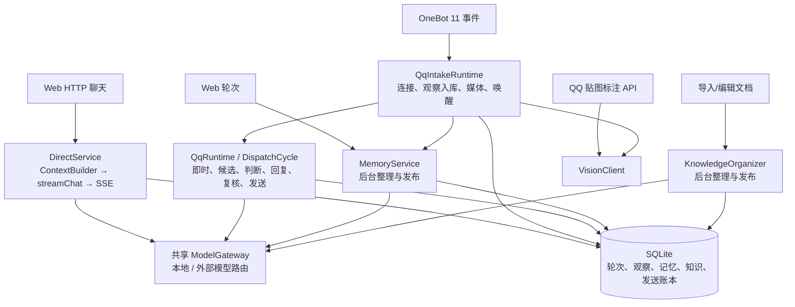

这张图说明**共享模型网关和数据库不等于共享 Agent Loop**：网页、QQ、记忆整理、知识整理分别决定何时调用模型以及给模型什么上下文。`VisionClient` 的实际调用点与文本模型网关也不是同一个对象。[装配代码](/Users/nkanf/clones/superstring/src/server/runtime.ts:93)

### 目标总体架构

目标是统一运行与上下文入口，同时保留渠道、记忆、知识各自的模块职责。图中的 `WakeScheduler` 是同进程内的逻辑边界，不意味着新增消息中间件；Memory/Knowledge 的模型工作也走同一个 `AgentRuntime`。

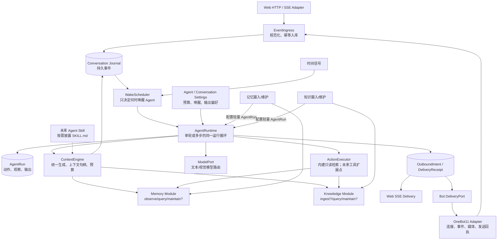

**核心原则**：一个 `AgentRuntime` 承接所有模型调用。主对话 Agent 将可恢复的会话/行动轨迹带进每次运行；轻量 Agent 可以只收到一份输入和一句指令，完成一次结构化输出。两者使用同一运行协议，轻量运行不必伪装成对话轮次。每次运行的上下文由统一入口生成，并向外暴露可引用句柄；本轮不实现一个 Agent 继承另一个 Agent 上下文。确定性宿主负责唤醒、输入规范化、必要的权限/一致性校验、可配置预算、持久化和副作用提交；“要查什么、是否回应、对谁回应、怎样组织回复、收到动作结果后还要做什么”属于主 Agent 决策。网页和群聊的触发、发送、媒体、多人目标及回执不同，通过会话事实和渠道能力呈现给 Agent，不在核心写大量 `if (channel === "qq")`。记忆/知识模块保留数据写入和维护时机的职责，但需要 LLM 的步骤都通过 `AgentRuntime` 执行，而不是各自调用 `ModelGateway`。

### D4/D6：OneBot 适配与唤醒

**现状**：OneBot 连接/事件解析已有一层，但接入、观察入库、媒体读取和叫醒 QQ 运行器仍汇在 `QqIntakeRuntime`；`QqRuntime` 自己轮询并按“即时优先、主动随后”的顺序推进两条 QQ 执行链。Web 请求绕开这套调度。[接入](/Users/nkanf/clones/superstring/src/server/services/qq-intake.ts:300) · [唤醒装配](/Users/nkanf/clones/superstring/src/server/runtime.ts:162) · [调度轮次](/Users/nkanf/clones/superstring/src/server/services/qq-runtime.ts:209)

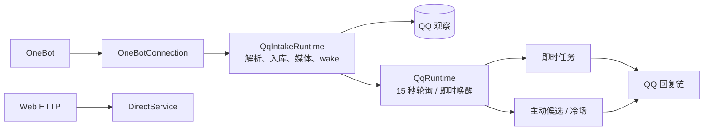

**拟改**：把连接和事件/发送编码收敛到 `OneBot11Adapter`；入库与绑定交给 `EventIngress`；`WakeScheduler` 接收已入库事件和时间信号，只产出运行机会；Web 也交付同类机会。图中是逻辑模块，不要求分进程或引入消息队列。

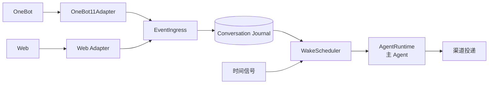

建议命名为 `OneBot11Adapter`，而非 `QqRuntime` 的简单改名。它负责：连接与鉴权、协议事件/段解析、平台消息 ID 与媒体引用、发送请求、回执分类，向内核交付规范化事件及可用能力；NapCat 特有的取媒体引用行为应封装在实现扩展或能力探测中。[当前协议实现](/Users/nkanf/clones/superstring/src/server/services/onebot-connection.ts:227) · [NapCat 媒体假设](/Users/nkanf/clones/superstring/src/server/services/onebot-connection.ts:250)

`QqIntakeRuntime` 中的“绑定到哪个 Agent、是否观察、幂等入库”迁到 `EventIngress`/绑定服务；“什么时候值得唤醒 Agent”迁到 `WakeScheduler`（@、新消息、合并窗口、冷场定时等）；唤醒不等于批准发言。Agent 自己从事件与能力列表决定是否发言、目标、查资料、选贴图和输出。发言频率、允许的目标和主动发言阈值是会话设置；发送边界只执行真正必须强制的限制，无须单独建立一个总括式 `BotConversationPolicy`。以后接另一个 bot 协议可重用内核；群聊能力仍需按平台适配。[当前触发](/Users/nkanf/clones/superstring/src/server/services/qq-dispatch.ts:103) · [当前输出](/Users/nkanf/clones/superstring/src/server/services/qq-send-transport.ts:102)

唤醒调度是本项目群聊 Agent 的独立运行问题：它处在会话日志和 Agent 运行之间，负责合并机会、到期扫描与会话级串行；不读取模型提示词，也不替 Agent 判定“应该说什么”。[现状、目标契约与迁移验收](/Users/nkanf/docs/superstring/refactor/03-会话与唤醒调度.md)

**预期**：新增一个渠道只需适配消息与发送能力；唤醒机制不导入 OneBot 类型；群聊的主动性继续存在，但决定发言的是主 Agent。[激活细节](/Users/nkanf/docs/superstring/refactor/03-会话与唤醒调度.md)

领域身份不要继续只用 `qq/...` 字符串表示所有渠道。建议采用 `{channelKind, adapterId, accountId, conversationKind, conversationId}` 的结构化地址；`platform` 保留为可辨认的真实平台属性，不能把 OneBot 协议版本误当平台。迁移初期允许在旧键与新地址之间双向映射，不急于搬迁历史表。[现有事件键](/Users/nkanf/clones/superstring/src/server/services/onebot-protocol.ts:160)

### D5：一个会话模型容纳一对一和群聊

当前代码按 `Web` 和 `QQ` 分业务线，但**交互拓扑**更有解释力：Web 会话与 OneBot 私聊都是 Agent 与一个人直接交谈；OneBot 群聊是在共享房间观察多人发言，消息可能并非对 Agent 说，Agent 也可能面向多人发言。OneBot 解析已经给出私聊/群聊、发言人、@ 和回复引用；网页路径持有 session/turn/message。[OneBot 事件字段](/Users/nkanf/clones/superstring/src/server/services/onebot-protocol.ts:32) · [网页轮次](/Users/nkanf/clones/superstring/src/server/db/schema.ts:103)

**现状结构**：Web 轮次单独持久化；QQ 私聊从即时任务取得；QQ 群聊还分即时与主动候选。三者没有共同的会话事件读写契约。

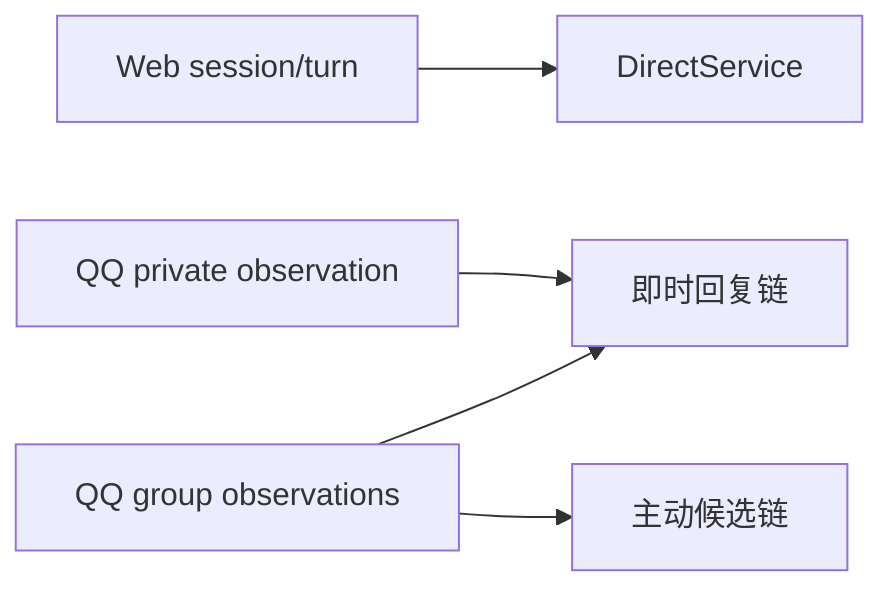

建议只有一个 `Conversation`/`ConversationEvent` 领域模型，不派生 `WebConversation`、`QqPrivateConversation`、`QqGroupConversation` 三套 Agent 状态机：

```ts
type Conversation = {
  id: string;
  agentId: string;
  address: ChannelAddress;       // Web session 或 OneBot account + peer
  audience: "direct" | "shared"; // 交互拓扑，不是平台名
  participants: ParticipantRef[];
  capabilities: ChannelCapabilities; // 文本、图片、@、多条输出等
};
type ConversationEvent = {
  id: string;
  conversationId: string;
  author: ParticipantRef;
  parts: ContentPart[];
  addressedToAgent: boolean;
  replyTo?: string;
  occurredAt: string;
};
```

**目标结构**：三个入口映射到一个会话模型；差别进入事件事实和渠道能力，不派生第三种核心循环。

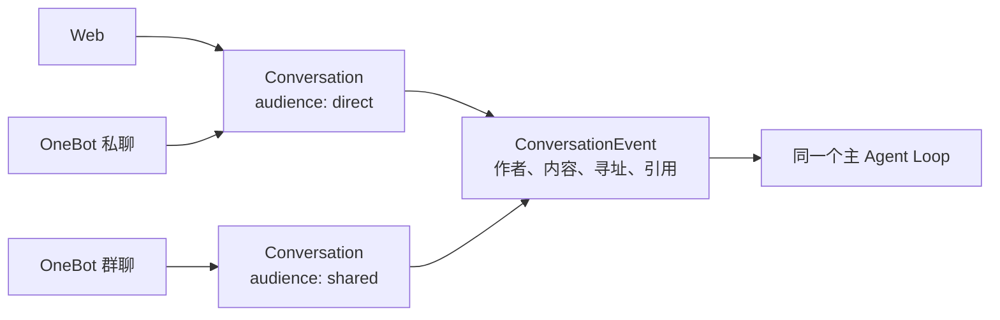

这是领域形状草案。Web 与 OneBot 私聊都映射为 `direct`：新的人类消息通常立即唤醒 Agent。群聊映射为 `shared`：@、回复引用、活动和定时器都可唤醒 Agent，但**唤醒只给它一次观察与行动机会**，不自动等于发言。运行循环、记忆/知识消费、压缩及动作记录完全一致；群聊额外把成员、寻址、广播受众和媒体能力带入上下文。一个统一模型能表达人数与可见性差异，不需给 QQ 私聊单独设计一套“次等 Agent”。[现有私聊/群聊分类](/Users/nkanf/clones/superstring/src/server/services/qq-trigger-contract.ts:31)

`audience` 不是唯一条件：一对一与群聊的真正差别还包括消息是否指向 Agent、可见成员集合、回复目标和渠道发送能力。它们作为数据交给同一循环，不用在循环内部按平台名字分叉。历史表是否物理合并可由数据迁移成本决定；对 Agent 的读写契约必须统一。

### D1/D2：真正以 Agent 为中心的循环

**现状**：下面是共享 `ModelGateway` 上方实际散开的模型调用控制流。Web 主回复、Web 检索选择/压缩、QQ 主动判断/回复/复核、记忆整理、知识整理各自决定 prompt、调用顺序和结果写回位置；QQ 媒体/贴图的视觉调用另经 `VisionClient`。`ModelGateway` 只是底层模型路由，不能把这些箭头看成一个 Agent。[Web](/Users/nkanf/clones/superstring/src/server/services/direct-service.ts:190) · [Web 辅助调用](/Users/nkanf/clones/superstring/src/server/services/context-builder.ts:527) · [QQ](/Users/nkanf/clones/superstring/src/server/services/qq-initiative-cycle.ts:89) · [记忆](/Users/nkanf/clones/superstring/src/server/services/memory-service.ts:399) · [知识](/Users/nkanf/clones/superstring/src/server/services/knowledge-organizer.ts:233) · [视觉装配](/Users/nkanf/clones/superstring/src/server/runtime.ts:106)

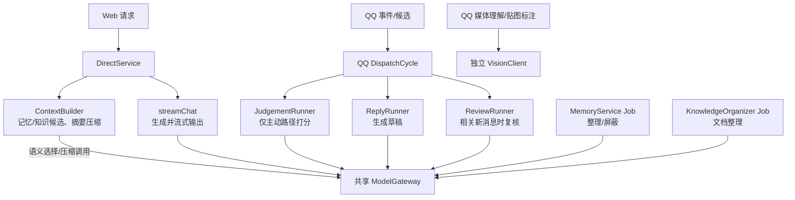

**拟改**：`DirectService`、QQ 判断/回复/复核以及记忆/知识的模型调用进入同一个 `AgentRuntime`。主对话 Agent 持有会话与开放式行动循环；整理/筛选 Agent 可用相同运行协议单轮完成。确定性宿主只处理唤醒、授权、预算、并发和外部效果边界。**预期**：模型任务之间能复用上下文入口、模型路由、动作结果与运行记录；QQ 不再有写死的“判断→回复→复核”主流程。

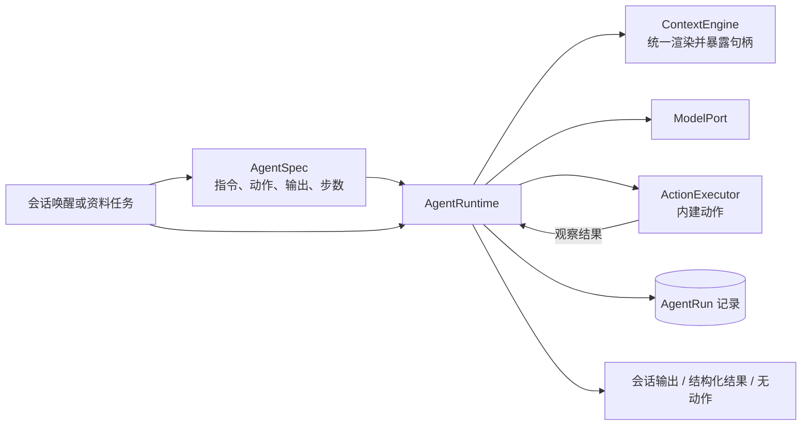

```text
ConversationHost -> AgentRuntime.run(AgentSpec, AgentInput)
  render conversation context (leaf 任务只渲染当次输入)
  ModelPort.next -> invoke(memory.query | knowledge.query) | final | none
  invoke -> 只读动作 -> observation -> 下一模型步骤
  final -> 0..N OutputDraft（每条独立目标/正文）
  Web: StreamSession -> delta -> 完成提交；OneBot: CommittedOutputIntent -> 逐部件投递
  none -> run 终止
投递回执 -> 下一次会话观察；不重新打开已完成的 run
```

真实模型协议、结构化 JSON 校验与 Web SSE 见[Agent 运行与上下文协议](./02-Agent运行与上下文协议.md)；外部投递见[投递与恢复](./05-投递与恢复状态机.md)。

这是目标控制权的**示意**，不是已经确定的 API 或故障策略。主 Agent 从会话来源读取轨迹，能多次行动、接收观察、结束；单轮 Agent 可以只用当次资料快照、`actions=[]`、`maxSteps=1`，直接返回满足 schema 的结果。本轮内建模型动作只含可重算的记忆/知识查询；读取新事件由宿主追加观察，贴图选择通过输出意图和现有资源能力表达，输出是终止结果而非普通 `invoke`。后续工具扩展须先定义副作用语义。Web 的最终回复是主 Agent 的会话输出；Bot 是否插话、回哪个人、发文字还是贴图也由主 Agent 输出决定。`initiative_min_score`、频率上限、收件人范围和发送前版本校验可继续作为程序强制的硬约束；它们不再指定“先调用判断模型，再调用回复模型，再调用复核模型”的步骤顺序。[旧 QQ 固定链](/Users/nkanf/clones/superstring/src/server/services/qq-initiative-cycle.ts:89) · [旧 Web 固定链](/Users/nkanf/clones/superstring/src/server/services/direct-service.ts:190)

**持续上下文**只在需要它的 Agent 配置中启用：主对话 Agent 通过 `ConversationJournal` 读取用户/群消息、模型决定、动作结果和已发送消息；`ContextEngine` 用压缩、近期原文、记忆/知识证据和预算生成模型输入。轻量 Agent 可只使用当次输入快照。新消息在主 Agent 运行中到达时，宿主把它作为新观察插入；发送边界拒绝基于过期游标的动作，Agent 看见新观察后自己决定修改还是继续。这轮的复核能力由主 Agent 处理新观察；另起一个可读取主 Agent 上下文的复核 Agent 是未来可能的组合方式，不在本轮实现。自动续跑受 Agent 配置的步数/期限约束；预算用尽不发送过期草稿。未知外部回执不得盲目重发，按出站状态机处理。[现有 Web 压缩](/Users/nkanf/clones/superstring/src/server/services/context-builder.ts:909) · [现有 QQ 复核](/Users/nkanf/clones/superstring/src/server/services/qq-review-runner.ts:48)

### D3：先暴露上下文出口，后续再组合

**现状**：Web、QQ 和整理/选择调用分别拼出自己的消息数组；其它调用没有统一接口可询问“主 Agent 这一步实际看到了什么”。**拟改**：每次 `AgentRuntime` 调模型前由 `ContextEngine` 渲染上下文，并把这次运行的上下文通过只读句柄暴露。**预期**：现有运行可被诊断；未来加预处理层时，可以从统一入口读取主 Agent 的上下文，筛选、补充资料后交给另一个 Agent。本轮**只做出口，不做继承、合并或自动派生上下文**。

当前并非完全没有共享代码：Web 和 QQ 回复都能走 `recallMemoryItems`；但 Web 的摘要/压缩、知识语义选择与 QQ 的判断/回复窗口分别拥有自己的调用与预算规则。QQ 主动判断档还直接取词项候选，而 QQ 回复档目前不注入知识库。[共享记忆检索](/Users/nkanf/clones/superstring/src/server/services/context-builder.ts:300) · [QQ 记忆包装](/Users/nkanf/clones/superstring/src/server/services/qq-memory-recall.ts:107) · [QQ 判断资料](/Users/nkanf/clones/superstring/src/server/services/qq-judgement-material.ts:25) · [知识差异](/Users/nkanf/docs/superstring/03-记忆与知识检索.md)

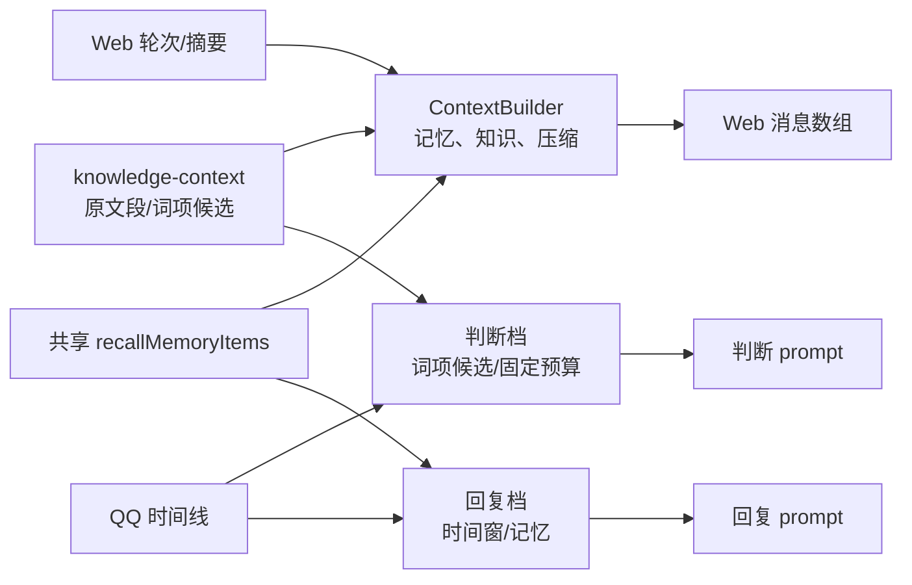

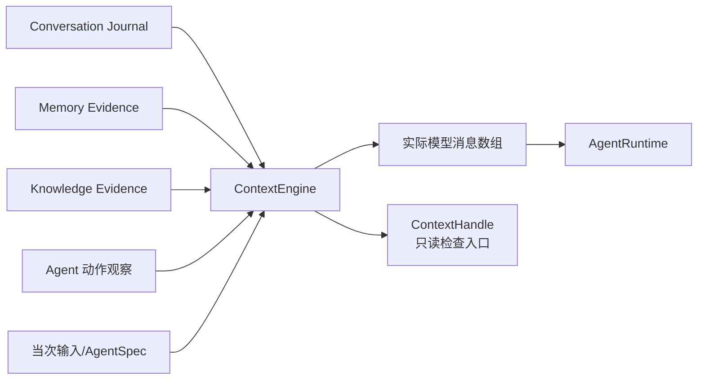

```ts
type ContextSourceRef = {
  source: string;     // conversation、memory、knowledge、input 等
  key: string;
  version?: string;
};
type ContextHandle = { runId: string; stepId: string };
type RenderedContext = {
  messages: ModelMessage[];     // 本次实际发送给模型的消息
  sources: ContextSourceRef[]; // 来源与版本
};

interface ContextAccess {
  inspect(handle: ContextHandle, principal: Principal): Promise<RenderedContext | ExpiredContext>;
}

type AgentRunResult<T> = {
  output: T;
  contextHandle: ContextHandle;
};
```

这是**最小接口形状**。句柄只定位、不授权；精确快照不长于所含来源的保留期，知识撤权/来源删除时删除相关正文，过期后只保留布局元数据。以后要做“复核 Agent 读取主 Agent 上下文”，可以由一个预处理函数读取句柄、选择材料、调用同一 `AgentRuntime`；那是后续功能，不写进这次的主循环。

### D10/D11：未来工具与 Skill 的最小扩展面

**现状**：当前 `ModelGateway` 只有文本完成/流式输出能力，QQ 和 Web 的“检索”“发送”是外层业务代码固定安排的步骤；仓库 `tools/` 是工程脚本，不是 Agent 可调用工具目录，也没有运行时 Skill 加载。[当前能力审查](/Users/nkanf/docs/superstring/05-工具调用与Skills.md)

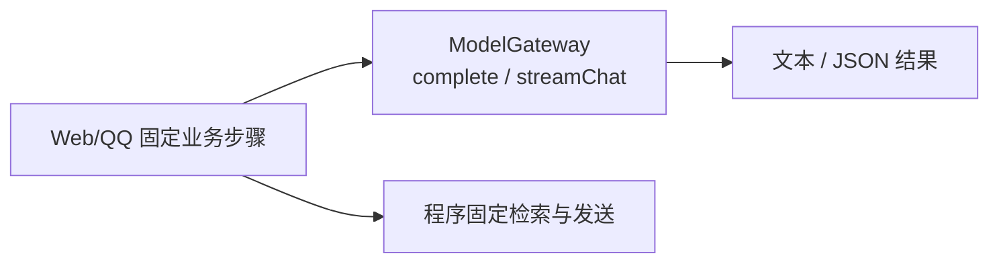

**拟改**：主 Agent 的一步可以是内建动作调用，执行结果回到同一个运行记录；上下文有可插入指令块的出口。**预期**：本轮内建能力可以真正驱动开放式循环；以后接工具或 Skill 不必重写循环。本轮不交付第三方工具/Skills/MCP。

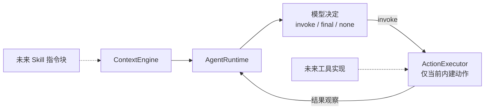

本轮**不实现**通用工具目录、MCP 接入、Skill 加载器或 Skill Provider。要提前固定的只有两处：`AgentDecision.invoke` 是带名称、参数、结果观察的**只读内建动作**协议；`ContextEngine` 能按需加入带来源的指令块。当前用内建记忆/知识查询跑通循环；输出由 `final` 产生 `OutputDraft`，不伪装成可重放的 `invoke`。以后扩展工具仍须按其副作用补恢复语义。

[Agent Skills 规范](https://agentskills.io/specification)中的 Skill 是含 `SKILL.md` 的目录，文件使用 **YAML frontmatter + Markdown**；[渐进披露](https://agentskills.io/home)是先给名称/描述，适用时加载完整指令，需要时再读取引用资源。未来可以用 JSON 配置记录启用哪些技能、关联哪些工具，但 **Skill 文件本身不是 JSON**。因此现在只保留上下文插入和按需读取的接口位置，不设计独立的 `SkillProvider` 体系，也不提前实现发现、热加载或授权机制。

### D7/D8：记忆与知识只固定外部语义

前版把当前实现中的“摄入→分块→整理→索引→检索”画成了未来标准流程，过度贴合现有代码。更合适的边界是：Agent/会话能**提交来源或观察**、能**查询**、能**请求维护/修订**，得到有来源的结果；模块内部如何存储、维护和搜索由实现自己决定。

#### D7 记忆：现状与目标

**现状**：手动/自动 Web 轮次、QQ 观察批次、已有记忆 merge 进入记忆任务；`MemoryService` 调模型生成一条记忆或 `null`，并做来源/状态维护。读取时 Web 与 QQ 回复共享 `recallMemoryItems` 的模式核心，QQ 主动判断另走小预算词项候选。[整理输入与模型](/Users/nkanf/clones/superstring/src/server/services/memory-service.ts:314) · [共享读取](/Users/nkanf/clones/superstring/src/server/services/context-builder.ts:300) · [QQ 判断](/Users/nkanf/clones/superstring/src/server/services/qq-judgement-material.ts:25)

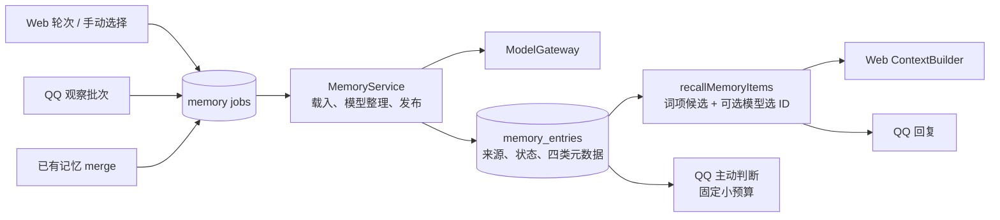

**拟改**：保留现有数据和策略为一个内建 `MemoryModule`；模块接收观察/修订、提供查询与可选维护；凡需模型整理或语义选择的地方调用统一的轻量 `AgentRuntime`。**预期**：四类元数据、六种读取模式、作用域与来源修订能力保持；未来换摄入、维护或检索算法时，主 Agent 不需认识 `memory_jobs` 或词项索引。

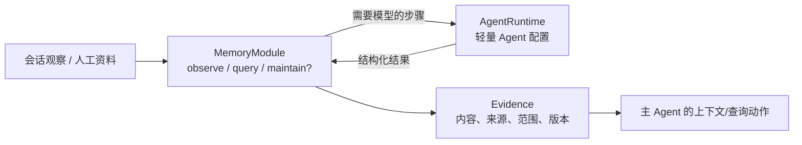

#### D8 知识：现状与目标

**现状**：文档整理按约 1536 字节段调用模型，保存整理稿和原文偏移映射；在线查询从授权文档原文另按约 768 字节切段做词项排序，Web 可再用模型选候选，QQ 判断档取前列小预算，QQ 回复档当前不注入知识。[整理](/Users/nkanf/clones/superstring/src/server/services/knowledge-organizer.ts:8) · [在线切段与授权](/Users/nkanf/clones/superstring/src/server/services/knowledge-context.ts:76) · [消费差异](/Users/nkanf/docs/superstring/03-记忆与知识检索.md)

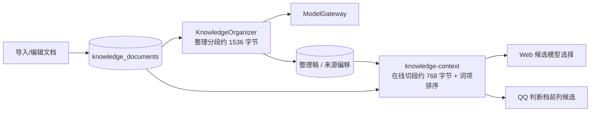

**拟改**：当前文档/分段/整理实现成为一个 `KnowledgeModule`；对 Agent 只给资料输入、查询、可选维护和有来源的 `Evidence`，模块内需模型时调用轻量 `AgentRuntime`。**预期**：当前授权、原文/整理稿及来源映射完整保留；将来整篇检索、图查询或远程知识后端都不用提供一个虚假的 chunk 接口。

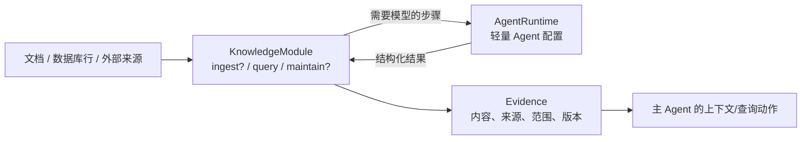

上面两张目标图都只画**模块对外边界**，内部可以维持现有阶段，也可以用完全不同的算法；没有规定每个模块必须有 Source/Chunker/Index/Retriever 等一排类。

接口形状只表明能力，可按模块声明支持哪些操作；`?` 表示并非每个实现都必须支持写入或维护。例如只读知识后端可以只支持 `query`；外部资料来源可以由轻量连接器把输入交给某个知识模块。目标不是规定每个后端都要有 Store、Index、Chunker 六层对象。[当前记忆来源](/Users/nkanf/clones/superstring/src/server/services/memory-service.ts:314) · [当前知识在线检索](/Users/nkanf/clones/superstring/src/server/services/knowledge-context.ts:76)

| 模块 | 对 Agent 和应用稳定暴露的语义 | 实现内部自由选择 |
| --- | --- | --- |
| Memory | 接受会话观察或人工修订；按 Agent/会话和权限查询；维护有效记忆及来源；返回可引用的结果 | 直接事件回放、模型整理、规则合并、SQLite/远程存储、词项/向量或其它检索 |
| Knowledge | 接受一个资料来源或连接器引用；按权限查询；可同步、更新或失效资料；返回可引用的结果 | 整篇文档、分块、数据库行、图结构、远程搜索 API、预整理稿或直接查询 |

两者共用的可以只是 `Evidence`（内容、来源标识、版本、访问范围）与查询预算，不必共享摄入/维护基类。`ContextEngine` 消费 `Evidence`，Agent 也可主动调用当前内建查询动作；具体模块负责把自己的结果转换到这个边界。当前实现的 4 类记忆 `kinds`、六种读取模式、来源关系、人工纠错，以及知识原文/整理稿、来源偏移和授权，都由**现有内建模块**继续实现；它们不是未来所有模块都必须照搬的领域字段。[记忆现状](/Users/nkanf/docs/superstring/03-记忆与知识检索.md)

因此，**分块不是知识系统的前提**。当前“整理时 1536 字节分段、读取时 768 字节分段”只属于 SQLite/词项实现；新模块可以整篇推理、向量检索、图查询或访问外部知识服务。不同实现的结果质量和来源可信度需要各自验收，但核心 Agent 不应询问它有没有 chunk 或索引表。[当前整理分段](/Users/nkanf/clones/superstring/src/server/services/knowledge-organizer.ts:8) · [当前在线切段](/Users/nkanf/clones/superstring/src/server/services/knowledge-context.ts:118)

### 现有实现如何落进新架构

这里的“统一”首先统一**职责与交互契约**，不要求把现有算法合成一种算法，也不要求一个阶段对应一个接口类。Web 与 Bot 对同一记忆/知识能力可以使用不同参数、不同选择策略，具体实现留在模块内；只有证明两条实现确实可复用时才提取公共代码。

| 当前能力 | 在目标架构中的位置 | 迁移时保持的差异 |
| --- | --- | --- |
| Web 用户消息、OneBot 私聊/群聊事件 | 渠道适配 → `ConversationEvent` → 同一 `AgentRuntime` | Web 立即响应；私聊定向响应；群聊可能只观察或主动插话 |
| Web `ContextBuilder`、QQ 判断/回复上下文 | 同一 `ContextEngine`，根据会话事实与配置贡献材料 | Web 摘要/语义候选与 QQ 时间窗/多人线索先保留各自策略，随后评估共享能力 |
| Web/QQ 的记忆观察、维护与读取 | 一个 `MemoryModule` 边界下的内建策略/配置；模型步骤调用 `AgentRuntime` | 来源、触发、作用域、读取模式与模型预算可以不同，不强制拆成六个插件 |
| Web/QQ 的知识读取及后台整理 | 一个 `KnowledgeModule` 边界下的内建策略/配置；模型步骤调用 `AgentRuntime` | 原文/整理稿、授权、来源映射和目前的分段策略仅属于当前实现 |
| QQ 主动判断、回复、复核与 Web 回复生成 | 会话配置、唤醒原因、上下文材料、可用动作，交给同一 Agent 循环决策 | 迁移后不把“判断模型→回复模型→复核模型”保留成核心固定阶段 |
| 记忆整理、知识整理、语义选择中的模型调用 | 相应模块选择输入和发布时机，调用配置化的轻量 Agent | 可单轮、无动作、只输出结构化结果；其上下文同样有可查询句柄，不绕开统一运行抽象 |

因此，现状中的不同 LLM 调用可以**统一成为 Agent 的不同配置与运行**：主对话 Agent 持续运行并掌握对话下一步，整理/选择 Agent 可以单轮运行。记忆/知识模块负责何时提交资料和如何保存结果；模型推理、上下文来源、动作与输出契约都经过同一 Agent 抽象。只把现有调用改名为 Agent 而不统一这些运行机制，不会得到上述组合收益。[Web 链路](/Users/nkanf/clones/superstring/src/server/services/direct-service.ts:190) · [QQ 链路](/Users/nkanf/clones/superstring/src/server/services/qq-dispatch-cycle.ts:189) · [记忆整理](/Users/nkanf/clones/superstring/src/server/services/memory-service.ts:399)

## 4. 上下文输出与兼容约束（D3/D7/D8）

**现状**：Web 与 QQ 的上下文模板、摘要/窗口和候选预算分散。[Web 组装](/Users/nkanf/clones/superstring/src/server/services/context-builder.ts:909) · [QQ 窗口](/Users/nkanf/clones/superstring/src/server/services/qq-context-contract.ts:202) **拟改**：`ContextEngine` 根据 Agent 输入选择 `instructions/persona`、`conversation facts`、`history`、`memory/knowledge evidence`、`action observations`、`current input` 等材料，输出带来源、预算和顺序的消息列表及 `ContextHandle`。Web 与 OneBot 私聊都走 `direct` 会话视图；群聊增加成员身份、寻址/@ 和多人时间线。记忆/知识只通过查询结果参与，不让核心知道它们怎样组织数据。**预期**：两类 Agent 都从同一入口得到上下文，能诊断“模型到底看到了什么”；以后再决定如何在 Agent 间复用。

统一接口应容纳当前最完整的能力，而非取各渠道的最低交集。例如 Web 已有摘要压缩与候选语义筛选；新上下文构件应允许 Bot 在相应策略和预算下使用这些能力。首轮切换时按现有输出建立兼容基线；为 Bot 增加摘要或更完整的知识/记忆语义选择可作为明确的增量能力验收，避免把质量变化藏在模块搬迁里。[现有 Web 压缩](/Users/nkanf/clones/superstring/src/server/services/context-builder.ts:917) · [现有 QQ 判断档](/Users/nkanf/clones/superstring/src/server/services/qq-judgement-material.ts:25)

## 5. 状态、故障和副作用的设计问题（D12/D13）

**现状**：Web `DirectService` 直接管理流式模型输出、SSE 与轮次落库；QQ 回复链在生成后经过复核/预检/事务提交，再由 OneBot 发送并记录部件回执。这两条链的“模型结果何时可以对外发布”没有共同出口。[Web](/Users/nkanf/clones/superstring/src/server/services/direct-service.ts:190) · [QQ 提交与发送](/Users/nkanf/clones/superstring/src/server/services/qq-dispatch-cycle.ts:261)

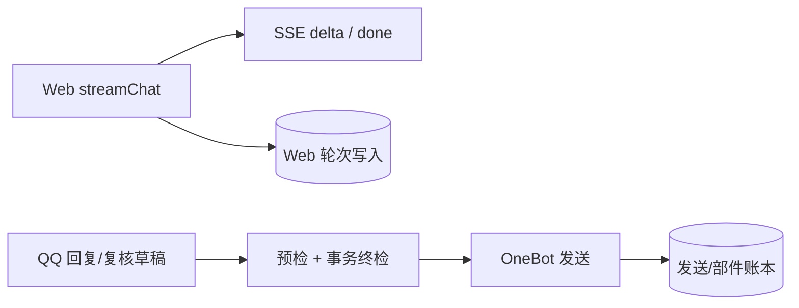

**拟改**：Agent 输出统一表达为对话结果/出站意图，真正的 Web 流式投递和 OneBot 网络发送仍由各渠道承担；发送前只保留一次必要的所有权、配置与相关事件判断。**预期**：Agent 不需要知道 SSE 与 OneBot API 的细节；Web 原有流协议和 QQ `confirmed/failed/unknown/not_sent` 结果不丢。

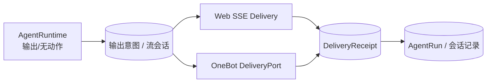

这里的“统一输出”是**对目标、内容类型和投递结果的共同契约**，不要求 Web 先算完整段文本再开始 SSE。Web 在流前建立 `StreamSession` 并逐段投递，成功后才完成消息；OneBot 在每条草稿正文完成后提交 `CommittedOutputIntent`，再做网络发送。两者各自的外部效果时序要在迁移测试里保持。

下图只画主对话 **run 本身**；渠道投递有独立状态机，OneBot 的 `unknown` 不回写成 run 的 `delivery_unknown`。逐部件回执、模型重试、配置变化和 Web 流式恢复按[投递与恢复状态机](./05-投递与恢复状态机.md)执行。

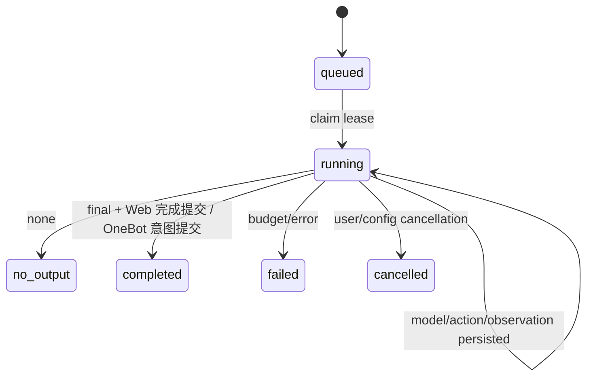

1. **外部效果有一个提交边界**：会话 Agent 的出站意图有稳定 ID；提交时判断运行所有权和必要的版本条件。已有 Web `generationToken` 和 QQ 全局租约可作为迁移参照。轻量 Agent 的模型结果由调用它的模块决定是否写入，不强制每个单轮任务拥有投递账本。[Web 租约](/Users/nkanf/clones/superstring/src/server/services/direct-service.ts:103) · [QQ 租约](/Users/nkanf/clones/superstring/src/server/services/qq-dispatch-cycle.ts:89)
2. **过时输入按相关性处理**：主 Agent 读取事件游标；发送前若出现会改变输出目标或内容的相关新消息，则作为新观察交回 Agent。无需把任何事件计数变化都等同于必须重算。发送是事务外网络动作，SQLite 与 OneBot 无法原子提交；需要出站意图/部件账本与 `unknown` 状态。[当前预检/提交](/Users/nkanf/clones/superstring/src/server/services/qq-dispatch-cycle.ts:261) · [当前发送账本](/Users/nkanf/clones/superstring/src/server/services/qq-send-transport.ts:1)
3. **取消与恢复**：模型/只读动作在无外部效果前可重新运行；步骤租约失效不得发布旧输出。OneBot `planned` 须过有效期/相关事实核验才可送，`sending` 重启为 `unknown`，不自动重发。未来副作用工具须另定义恢复语义。
4. **流式 Web 特例**：内部读取动作先完成，再开始面向用户的最终答复流；已经流出去的 token 不能撤回。Web 的最终消息落库与 SSE `done` 必须保持现有先后关系和失败语义。[当前 SSE/写入](/Users/nkanf/clones/superstring/src/server/services/direct-service.ts:203)
5. **不扩大权限**：`invoke` 只能调用本轮允许、经过参数校验和授权的内建动作。未来加入外部工具时沿用该边界；Skill 文本不能成为授予工具权限的途径。[当前能力边界](/Users/nkanf/docs/superstring/05-工具调用与Skills.md)

### 去掉重复防御，而非去掉真实边界

不设置独立的总括式 `HarnessPolicy`。运行配置、会话设置分别归各自拥有者；有外部副作用的发送边界执行必要校验。重构时按**能否阻止真实错误**逐项审查现有检查：

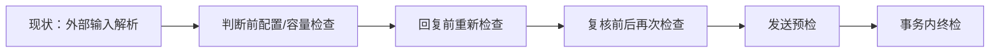

```mermaid
flowchart LR
  InputCheckNext[目标：外部输入一次规范化] --> SnapshotCheckNext[运行配置/权限快照]
  SnapshotCheckNext --> AgentCheckNext[AgentRuntime]
  AgentCheckNext --> CommitCheckNext[提交外部效果时<br/>必要的所有权与版本判断]
  CommitCheckNext --> ReceiptCheckNext[投递回执]
```

这只是**审查方向**，不是把每个当前检查一刀删除。重复检查是否真的无新增信息，要按它所处的并发窗口逐一验证；模型运行中变化的权限和发送目标仍可能要求提交时重查。[当前 QQ 预检](/Users/nkanf/clones/superstring/src/server/services/qq-send-preflight.ts:1) · [事务提交](/Users/nkanf/clones/superstring/src/server/services/qq-dispatch-cycle.ts:261)

| 检查位置 | 处理方向 | 原因 |
| --- | --- | --- |
| OneBot/HTTP 外部输入第一次进入系统 | 保留一次解析与规范化 | 外部数据无类型保证；错误应在入口定位 |
| 已验证的内部对象在判断、回复、复核、预检间反复 Zod 解析 | 找出重复项并删除，传递明确类型/快照 | 重复解析不增加新的事实，反而掩盖职责边界 |
| 配置、权限、来源版本在多个模型步骤前反复全量读取 | 一次获取运行快照；仅在提交副作用时比较必要版本 | 减少读写和不必要的旧结果失效 |
| 并发提交与 OneBot 发送回执 | 保留单一所有权/幂等边界及回执记录 | 事务与网络不能原子化，省略会造成重复或丢失发送 |
| 固定消息窗口、候选上限、步数与主动阈值 | 转为 Agent/会话设置，并按模型实际容量约束 | 这些是产品调参，不应写死在各条管线 |

当前 QQ 发送前的预检和各阶段校验可作为审查样本；上表是目标原则，不是未经验证就删除具体检查。[QQ 预检](/Users/nkanf/clones/superstring/src/server/services/qq-send-preflight.ts:1) · [QQ 提交](/Users/nkanf/clones/superstring/src/server/services/qq-dispatch-cycle.ts:261)

## 6. 建议拆成 3 个代码 PR（D14）

这三个 PR 是**可运行的迁移阶段**，不是按每个模块或接口拆一张票。每个 PR 合并时既有路径仍须可用；最终只剩一套 Agent 运行抽象和一套对话 Agent Loop。行为基线、旧数据升级和真实适配器验证放进相关 PR，不再单开文档或清理 PR。

| PR | 主要工作 | 可验收结果 |
| --- | --- | --- |
| **1. 统一运行与资料边界** | 定义 `AgentSpec/AgentRun/ContextHandle/ConversationEvent/Evidence` 等少量契约；建立 `AgentRuntime → ModelPort`，让记忆整理、知识整理、语义选择等现有独立模型调用使用轻量 Agent；给记忆/知识设置轻量模块边界，保留其内部算法。补 Web/QQ/记忆/知识的关键行为基线。 | 单轮 Agent 可只用一句指令和当次输入；运行结果暴露可检查的上下文句柄。内建记忆的四类/六种模式、知识的授权/原文/整理稿和维护结果等价；已迁移模块不再散落直连 Gateway。 |
| **2. 对话 Agent Loop 与一对一链路** | 使主 Agent 使用同一 `AgentRuntime` 的多步执行、会话日志和上下文视图；统一 Web 与 OneBot 私聊的 `direct` 事件模型，接入 `WebChannelAdapter`、`OneBot11Adapter` 与发送边界；迁移 Web 压缩/语义候选、QQ 私聊回复及 SSE/投递。 | Web 与私聊从同一 Agent Loop 运行；摘要、语义选择、记忆/知识、流式回复、私聊媒体/回执、取消与升级均有端到端证据。 |
| **3. 群聊迁移与收束** | 把群聊的 @、跟进、主动插话、冷场、多人目标、贴图和新消息复核变成同一 Agent 的输入、设置与动作；保留调度时机和必要发送约束。审查并删掉重复防御校验、硬编码调参和旧 Web/QQ 固定模型流水线。 | 群聊所有现有触发与输出能力通过新链验证；运行中相关新消息可进入同一上下文；旧数据可读，真实 OneBot/模型交互、Windows 升级路径及相关测试通过。 |

依赖顺序：`1 → 2 → 3`。PR 1 的模块实现不拆成 Source/Chunker/Index 等必经接口；PR 2 的一对一共性建立在会话拓扑上；PR 3 再用群聊验证抽象能否容纳共享受众。未来的 MCP、第三方工具、Skills、第三方记忆/知识后端都不在这三个 PR 里；本轮只把可组合的运行和上下文边界做实。[当前工具边界](/Users/nkanf/docs/superstring/05-工具调用与Skills.md)

## 7. 决策收口与实施导航

用户确定的方向：统一 AgentRuntime 和对话 loop；Web/OneBot 私聊/群聊都由会话 Agent 运行；ContextHandle 本轮只暴露读取接口；记忆/知识用轻量模块边界，不把当前切块/检索流程做成必经插件；不实现外部工具、MCP、Skills 或上下文继承；功能不降级；3 个代码 PR。其余运行与故障语义已在本方案中作出工程选择，实施时按[设计决策记录](./06-设计决策记录.md)核对。

| 主题 | 详细协议 | 具体改动 |
| --- | --- | --- |
| 模型动作、leaf 任务、上下文与 SSE | [Agent 运行与上下文](./02-Agent运行与上下文协议.md) | [逐文件计划](./07-逐文件实施计划.md) |
| Web/direct/shared、唤醒、游标 | [会话与唤醒](./03-会话与唤醒调度.md) | [数据迁移与验收](./08-迁移与验收.md) |
| 记忆和知识模块 | [记忆与知识](./04-记忆与知识模块.md) | [逐文件计划](./07-逐文件实施计划.md) |
| Web SSE 与 OneBot 出站 | [投递与恢复](./05-投递与恢复状态机.md) | [数据迁移与验收](./08-迁移与验收.md) |
| 前端 | [前端体验与架构](./09-前端体验与架构.md) | [逐文件计划](./07-逐文件实施计划.md) |
