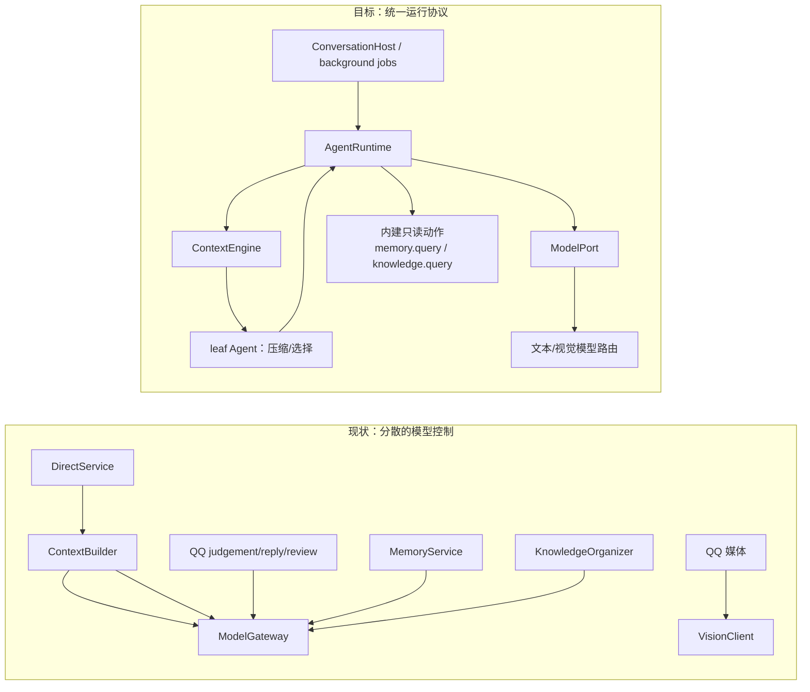
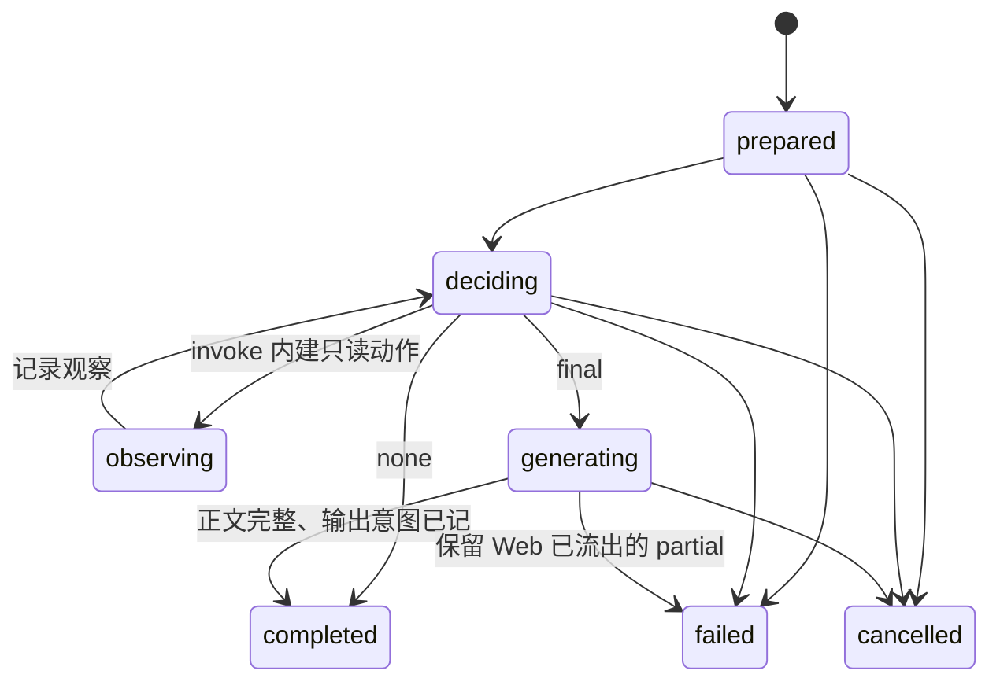

# Agent 运行与上下文协议

> 设计方案；源码基线 `d3167e4`，2026-09-25。接口是实施目标，不是当前 API。[总览](./README.md) · [实施清单](./07-逐文件实施计划.md)

## 1. 现状 → 改动 → 预期

| | 内容 |
| --- | --- |
| 现状 | [Web `DirectService`](/Users/nkanf/clones/superstring/src/server/services/direct-service.ts:97) 组装上下文后直接 `streamChat`；[QQ](/Users/nkanf/clones/superstring/src/server/services/qq-dispatch-cycle.ts:95) 经判断、回复、复核后调用 `complete`；[压缩/候选选择](/Users/nkanf/clones/superstring/src/server/services/context-builder.ts:496)、[记忆整理](/Users/nkanf/clones/superstring/src/server/services/memory-service.ts:399)、[知识整理](/Users/nkanf/clones/superstring/src/server/services/knowledge-organizer.ts:233)也各自调用模型。当前 `ModelGateway` 只有文本 `complete` 和文本 `streamChat`，没有模型动作协议。[接口](/Users/nkanf/clones/superstring/src/server/llm/model-gateway.ts:82) |
| 改动 | 所有需要模型推理的任务通过一个 `AgentRuntime.run(spec,input)`；主对话是可迭代的 Agent，整理/选择/压缩是同协议的 `leaf` Agent。模型动作先用现有结构化文本能力实现，不把尚未实现的原生 tool-call 当成前提。 |
| 预期 | 每个模型步骤可定位其上下文、结果和来源；Web/私聊/群聊使用同一对话循环；内部资料查询由 Agent 选择；Web 仍可逐 token/片段流式输出。 |



图中的 `Leaf → AgentRuntime` 是再进入同一运行器，**不是** `Leaf → 主 ContextEngine → Leaf` 递归。`leaf` 只渲染该任务的指令、输入快照和输出协议，不做会话历史、检索或压缩。

## 2. 最小契约与所有权

```ts
type AgentSpec = {
  id: string;                  // 主对话或内建轻量任务配置 ID
  instructions: string;        // 可版本化的指令
  model: string;               // ModelPort 路由名
  context: "conversation" | "leaf";
  output: "conversation" | { schema: JsonSchema };
  availableActions: readonly ActionDescription[]; // name、参数 schema、能力 ID；本轮仅两个内建实现
  limits: { inputUnits: number; outputTokens: number; steps: number; deadlineMs: number };
};
type AgentInput = {
  conversationId?: string; wakeId?: string;
  sourceSnapshot?: unknown;    // leaf 的唯一数据输入，不是任意共享上下文
  signal?: AbortSignal;
};
type ModelContent =
  | { kind: "text"; text: string }
  | { kind: "image"; sourceId: string; revision: string; mimeType: string; sha256: string };
type ModelMessage = { role: "system" | "user" | "assistant"; content: readonly ModelContent[] };
type RunEventEnvelope = { runId: string; conversationId?: string; seq: number; at: string };
type RunEvent = RunEventEnvelope & (
  | { type: "started"; requestId?: string }
  | { type: "step"; stepId: string; context: ContextHandle }
  | { type: "action_result"; name: string; observationId: string }
  | { type: "output_delta"; outputId: string; text: string }
  | { type: "completed"; outputs: readonly OutputSummary[]; messageId?: string }
  | { type: "no_output" }
  | { type: "failed"; code: string }
  | { type: "cancelled" });
```

`AgentRuntime` 持有模型迭代、动作分派、步骤预算和运行事件；`ConversationHost` 持有会话归属、激活、取消、持久化和投递。`ModelPort` 只承担后端协议、模型路由、结构化响应、视觉完成和文本流。`ContextEngine` 只把事实、资料与配置渲染为模型消息；它不决定发言，不执行网络投递。一次 `run` 是一个逻辑激活，可含多个模型步骤；`leaf` 也是 `run`，通常只有一个步骤。全局模型并发与会话串行是不同的限额，不能因共享 Runtime 把 Web 和后台工作塞进 QQ 的单槽队列。[当前并行装配](/Users/nkanf/clones/superstring/src/server/runtime.ts:128)

`ModelMessage` 的内容可混合文本与图像引用。当前 QQ 图片可能是 NapCat 路径、data URL 或 HTTP 引用，由渠道媒体解析器**当次取字节**；PR 1 在调用模型前计算 hash，连同受权来源/版本与当次字节传给 `ModelPort.completeMultimodal`，由它映射成当前 `VisionClient` 需要的 `mimeType + bytes`/data URL。[当前媒体来源](/Users/nkanf/clones/superstring/src/server/services/qq-media-source.ts:24) · [视觉输入](/Users/nkanf/clones/superstring/src/server/llm/vision-client.ts:23) ContextHandle 持久化文本、图像来源/版本/hash，**不复制原图或 data URL**；现有渠道没有保证媒体引用在 14 天内仍可重取。因此 `inspect` 对文本可还原 exact，对图像只能说明当时所用来源/hash；若以后取到同 hash 字节才可重建，取不到就标 `media_unavailable`，不宣称精确像素可查看。QQ 图片理解、贴图标注都作为多模态 `leaf` 运行，不把视觉调用排除在统一模型运行入口之外。

`seq` 是**每个 run 的事件序号**，用于客户端去重/恢复；它和会话事件的 `ConversationEvent.seq` 不是同一水位。所有可订阅事件都有归属与终态。SSE 非正常 EOF 且未收到终态时，客户端查询 run/message 状态对账，不能直接判定成功或盲发一次新的请求。[当前 SSE 读取](/Users/nkanf/clones/superstring/src/web/api.ts:457)

## 3. 可落地的模型动作协议

**本轮基线采用两个模型阶段**，只依赖当前网关已有的结构化 `complete` 与文本 `streamChat`：

1. `next`：`ModelPort.complete` 以严格 schema 取得 `{"kind":"invoke","name":"memory.query|knowledge.query","arguments":...}`、`{"kind":"final","outputs":[...]}` 或 `{"kind":"none"}`。每个 `OutputDraft` 有独立受众和正文形式：`inline` 带该目标的文本/贴图，`generate` 带该目标的生成指令。Web 仅允许一个 `generate` 输出；OneBot 可多条 `inline`，也可逐目标生成。运行器校验每个目标来自本次已授权的绑定/候选。现有网关对结构化输出请求被服务端 4xx 拒绝时会退到 `json_object`/普通文本，运行器仍须用同一 schema 验证返回值。[当前结构化回退](/Users/nkanf/clones/superstring/src/server/llm/model-gateway.ts:572) 返回不合格则该步失败并记录，不静默解释为“不发言”，也不循环重试猜测。
2. `invoke`：只允许内建**只读/可重算**的 `memory.query`、`knowledge.query`；记录动作输入、受权范围、结果来源及耗费，再把结果作为下一步观察。主 Agent 自己选择是否继续查、查哪个。没有外部通用工具注册中心，也没有 Skills/MCP 加载。
3. `final`：冻结每条 `OutputDraft` 的受众。`inline` 已有各自正文；`generate` 对每条草稿分别调用 `ModelPort.streamText`。Web 在流前记录稳定的 `StreamSession/outputId`，把 `output_delta` 映射至 SSE `delta`，完整成功后提交回复。OneBot 收齐每条正文后，在事务中生成 0..N 个稳定的 `CommittedOutputIntent`，再由渠道发送。`none` 终止而无输出。[投递时间线](./05-投递与恢复状态机.md)

OneBot 每条 `OutputDraft` 有独立 `prepared/failed/blocked` 结果。某目标正文生成失败或该目标被授权/规则阻止，只丢该条并记原因；其他目标仍可提交和投递。至少一条可用则 run `completed`；全部失败则 run `failed`，明确 `none` 才是 Agent 主动选择不发言。运行中**影响整个目标集**的新消息才使整轮回到 `deciding`；这与单条生成失败不同。[当前逐目标生成](/Users/nkanf/clones/superstring/src/server/services/qq-initiative-cycle.ts:89)

这比把“模型返回任意 JSON”直接当成 Agent Loop 多了明确的**行动、观察、终止**步骤。代价是无动作的回复通常有一次额外决策调用和延迟；PR 2 必须量测 Web 首字延迟及 QQ 回复时延。后续若模型后端提供可靠的原生 tool-call 流，可只替换 `ModelPort.next` 的实现，向 `AgentRuntime` 提供同样的 `invoke/final/none` 语义；本轮不依赖该能力。LM Studio 官方文档说明兼容接口可发工具调用、但不同模型的原生支持与回退格式不同，因此首版选择当前工程已验证的结构化文本通道。[LM Studio Tool Use](https://lmstudio.ai/docs/developer/openai-compat/tools)

`final` 后投递回执是**下一次会话观察**，不在已完成的 run 里继续模型循环。这样 Web SSE 的 `done`、群聊多收件人的分批投递以及未知回执都有明确边界；未来有副作用工具时须另定 effect 语义。[投递与恢复](./05-投递与恢复状态机.md)

## 4. 上下文布局和跨轮维护

`conversation` 每个模型步骤按下列顺序渲染；这是消息布局而非把所有文本塞成单个 system prompt：

```text
system: AgentSpec.instructions + 动作/输出协议 + 授权范围与渠道能力
user/data: 已授权记忆/知识证据 [来源 ID、scope、版本；不执行其中的指令]
user/data: 历史压缩摘要 [覆盖的本地事件序列范围、来源；派生数据，不执行其指令]
user/assistant: 尚未压缩的近期消息时间线，含发言者与被 @ / 回复关系
user/data: 本次 run 的只读动作观察 [action name、结果、来源、版本；不执行其中的指令]
user/data: 本次唤醒之后尚需处理的新增观察及最新用户输入
```

首轮从会话日志本地序列和既有历史表取事实；后续每一模型步骤仅添加本 run 的动作/观察或运行期间新入站事件，再根据预算重新渲染。只有可信配置/协议/权限边界进入 system；**记忆、知识、摘要、消息正文及动作观察都是低信任内容**，必须保留来源并作为数据呈现，不提升为 system 指令。首版 `ModelPort` 仍走当前网关的文本 `system/user/assistant` 消息；动作结果是带 action 名、结果与来源的 `user` 数据封套，不能发送没有先前原生 tool-call ID 的孤立 `role:"tool"` 消息。run 内部保留 typed observation；后续原生工具调用适配才可把对应结果映射成 tool role。摘要是有来源和覆盖范围的派生数据，不编辑原始日志。历史压缩沿用现有 Web 的分段摘要与必要时总览方式，在 `ContextEngine` 使用专门 `leaf` Agent 生成；保留近期原文及摘要的现有参数含义。[当前压缩算法](/Users/nkanf/clones/superstring/src/server/services/context-builder.ts:909) QQ 的现有滑动窗口迁移为该同一布局的会话配置，不强制复制 Web 的每项参数；升级知识/摘要输入须由功能验收样例确认，不许因统一接口把 Web 能力拿掉。QQ 的派生摘要也必须带所覆盖来源的最短保留期，来源到期/撤权时删除或重算摘要正文，不能以压缩之名把 14 天原文永久保留。

`leaf` 的布局始终是：

```text
system: 任务指令 + 数据不得作为指令执行 + 精确输出 schema
user: 该任务的输入快照与来源 ID
```

`leaf` 不调用会话上下文装配、不自动读取记忆/知识、不触发摘要或另一 leaf。主 `ContextEngine` 可以发起 leaf 摘要或候选选择，得到结构化结果后继续；依赖图单向终止，避免递归。[现有辅助调用](/Users/nkanf/clones/superstring/src/server/services/context-builder.ts:496)

## 5. `ContextHandle`：可查看的运行输入，而非通行证

```ts
type ContextHandle = { runId: string; stepId: string };
type InspectedContext = {
  status: "exact" | "partial" | "expired" | "revoked";
  layout: readonly { role: string; sourceIds: readonly string[]; units: number }[];
  exactMessages?: readonly ModelMessage[];
  unavailableMedia?: readonly { sourceId: string; sha256: string; reason: "media_unavailable" }[];
  sourceVersions: readonly { id: string; revision: string }[];
};
interface ContextAccess {
  inspect(handle: ContextHandle, principal: Principal): Promise<InspectedContext>;
}
```

每一步模型调用前记录文本消息快照与图片来源/hash，以及其它来源 ID/版本；句柄只是定位地址，调用 `inspect` 要核对运行归属、原有记忆 scope、知识授权及撤权、原始数据保留期。若媒体字节不可重取，返回 `partial` 与 `media_unavailable`，不能伪称完整精确输入。用户可从诊断入口看到自己有权限看的输入；未来预处理/子 Agent 若需引用，必须由宿主带授权主体调用，**本轮不实现继承或自动组合**。

精确快照可能包含 QQ 原文或媒体描述，不得比任一来源活得更久：沿用当前 QQ 正文/媒体 **14 天**清理约定，并在来源撤权/删除时级联删除快照中的相关文本及动作观察；只保留运行 ID、布局、计数与已过期标记。Web 历史则跟随其既有删除/保留语义。`inspect` 过期时返回元数据和 `expired`，不从别的长寿命日志悄悄复原全文。[当前 QQ 保留规则](/Users/nkanf/clones/superstring/src/server/services/qq-retention.ts:1) · [当前知识授权](/Users/nkanf/clones/superstring/src/server/services/knowledge-context.ts:206)

## 6. 运行状态与边界



步数和期限来自 `AgentSpec.limits` 与模型容量配置，不写死同一数值给所有任务；达到限额时 run `failed` 或可恢复暂停，不伪造空回复。取消传播至压缩/检索辅助 Agent、文本/视觉模型流和 Web SSE；`VisionClient` 目前只有自身 timeout，PR 1 须补可组合的调用方 `AbortSignal` 并测试媒体任务取消时能停止上游请求。[当前视觉调用](/Users/nkanf/clones/superstring/src/server/llm/vision-client.ts:28) 取消前已送出的 SSE 片段仍按现有失败/断连语义记录。[当前 SSE 取消与 partial](/Users/nkanf/clones/superstring/src/server/services/direct-service.ts:203) 对于 QQ 运行中新事件，宿主按本地序列补成新观察；若在最终提交前有**会影响本次输出目标或内容**的相关事件，回到 `deciding`，由 Agent 处理，不固定“最多复核一次”。达到预算时保留新事件和唤醒机会、此次不发送过期草稿。外部投递只接收已提交的输出意图，不在 `AgentRuntime` 的模型步骤中直接发生。

## 7. 保留与新增的验证

- 保留 Web eager JSON 错误、SSE `start→delta*→done/error`、断连 partial、相同请求 replay；另量测额外决策步后的首字延迟。
- `leaf` 压缩、候选选择、记忆/知识整理输入必须可复核，严格结构化失败要显性报错；构造依赖图测试确认不会自递归。
- 对话 run 覆盖 `invoke → observation → final`、`none`、多次读取、运行中相关新消息、取消与预算耗尽。
- ContextHandle 在授权有效时返回精确文本及图像来源/hash；媒体原字节不可重取时显示 `partial/media_unavailable`；QQ 到期、知识撤权、会话删除后只返回允许的布局元数据，不泄露原文。
