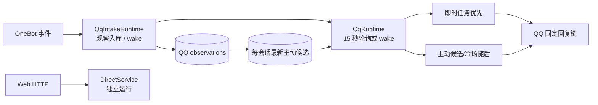
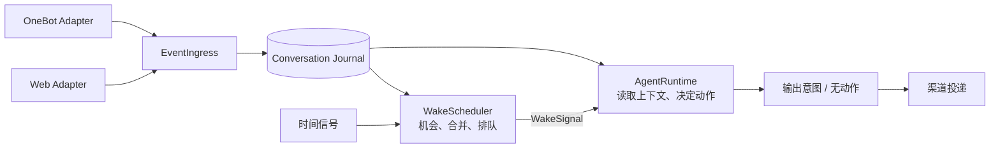

# 唤醒调度与 Agent 激活：群聊 Agent 的运行入口

> 设计方案；源码快照 `d3167e4`，2026-09-25。对应[架构决策 D6](./01-架构决策与现状目标对照.md)。这里讨论的是会话 Agent **何时获得一次运行机会**，不是让定时器决定该说什么。

## 1. 现状是什么

QQ 消息先入库，`QqIntakeRuntime` 在收到指向机器人的消息时调用 `onAddressedMessage`，使 `QqRuntime.wake()` 提前结束等待。`QqRuntime` 还以默认 15 秒间隔运行：先扫冷场，再尝试即时回复任务，最后尝试主动候选。即时路径先于主动候选，共享一个全局执行槽。[入库/唤醒](/Users/nkanf/clones/superstring/src/server/services/qq-intake.ts:300) · [绑定](/Users/nkanf/clones/superstring/src/server/runtime.ts:162) · [运行顺序](/Users/nkanf/clones/superstring/src/server/services/qq-runtime.ts:209) · [轮询默认值](/Users/nkanf/clones/superstring/src/server/services/qq-runtime.ts:38)

入站分类区分 `direct_reply`、`follow_up`、`chiming_in`、`idle_topic`。普通群消息更新一个按会话合并的主动候选，`ready_at = now + mergeWindow`；冷场 sweep 另产生候选；即时任务则从持久观察与发言记录重新推导。QQ 调度模块除了确定执行时机，还内含路径名称、注意名单、发言节奏和特定候选表语义。[分类](/Users/nkanf/clones/superstring/src/server/services/qq-trigger-contract.ts:31) · [候选](/Users/nkanf/clones/superstring/src/server/services/qq-dispatch.ts:95) · [即时任务](/Users/nkanf/clones/superstring/src/server/services/qq-dispatch.ts:213) · [冷场](/Users/nkanf/clones/superstring/src/server/services/qq-dispatch.ts:442)

Web 则由 HTTP 聊天请求直接进入 `DirectService.openReply`，没有与 QQ 共用的“会话激活”概念。[Web 入口](/Users/nkanf/clones/superstring/src/server/services/direct-service.ts:190)



## 2. 拟改：把调度放在 Agent 的激活层

推荐将 `WakeScheduler` 放在**事件接入与 AgentRuntime 之间**。这是 Agent 宿主的一部分，和 `AgentRuntime` 平级协作；它不是 OneBot 适配器里的 QQ 特例，也不是模型每一步都要调用的工具。Web 请求、私聊消息、群聊活动和定时机会都通过同一种激活协议进入 Agent。



**边界**：接入层报告事实并持久化；调度器决定**何时给哪一个会话一次观察机会**；Agent 决定**是否发言、回应谁、查什么和说什么**；投递层处理渠道编码、网络副作用与回执。群聊里的普通发言可以只留下观察而不立刻唤醒；唤醒也可以得到“无动作”。这使主动群聊成为 Agent 的运行方式，而不是另建一条 QQ 判断流水线。

调度层和 Agent 之间只传中性的信号，例如：

```ts
type WakeSignal = {
  conversationId: string;
  cause: "addressed_message" | "conversation_activity" | "idle_timer" | "web_request";
  throughSeq?: number; // 本地持久日志的单调序列，不是平台 eventKey/秒级时间
  readyAt: number;
  dedupeKey: string;
};
```

字段是示意，不要求维持这四个固定枚举。关键是 `cause` 记录**为什么获得机会**，而非命令 Agent 走 `direct_reply` 或 `chiming_in` 固定链。调度器不导入 OneBot 消息类型、提示词、记忆/知识实现或模型网关；它只依赖会话身份、事件游标、时钟与少量会话级调参。`WakeScheduler` 是模块边界，不要求独立进程、消息中间件或 Orleans/Temporal 一类新基础设施。

## 3. 预期执行方式

1. 接入层把消息持续写入会话日志。`@`/私聊/Web 输入可以立即形成唤醒；普通群活动可按会话合并窗口形成延迟唤醒；冷场由时间信号形成唤醒。新增渠道只需把自己的事件和时机映射到这些中性概念。
2. 每个会话同一时间最多有一个主 Agent 运行。多个未消费的唤醒可以合并，但**消息本身不能被候选替换吞掉**；Agent 醒来时从本地日志序列读取全部需要观察的新事件。全局模型并发另行配置，不因为 QQ 现有单槽把 Web 和后台任务一起串行。
3. 到期机会先处理指向 Agent 的消息，再处理普通活动和冷场；同一优先级保留当前“最近即时候选优先”的语义，平局再按稳定入库序列。合并窗口、优先顺序和并发数是可配置参数。当前跨 binding 挑最新即时消息而非最早 `readyAt`；此处不能悄悄改变。[当前排序](/Users/nkanf/clones/superstring/src/server/services/qq-dispatch.ts:233)
4. 只有 run `completed/no_output`（OneBot 的输出意图已在同一事务提交）时，才在该事务内确认**本次实际消费的本地事件序列上界和 wake ID**。运行期间的新事件仍留在日志中；`failed/cancelled` 不推进消费游标，wake 按可配置退避 `retryAt` 保留，达到重试上限转可见错误/人工处理而非无限循环；已发起外部投递则按出站账本恢复，不能重跑造成重复发送。调度器不根据 Agent 文本评价回答质量，也不调用模型判断应否发言。
5. 保留一个低频的到期扫描来恢复进程重启后尚未消费的机会；入站通知用于降低延迟。这样可沿用现有 SQLite，不依赖内存里的 `wake()` 信号作为唯一事实来源。

这些是目标规则，不是当前代码已有的保证。特别是当前 `latest candidate` 的替换语义、即时与主动任务的选择、全局租约及失败后是否重新获得机会，需要逐项迁移和验收。[当前候选替换](/Users/nkanf/clones/superstring/src/server/db/qq-dispatch-repository.ts:143) · [当前失败语义](/Users/nkanf/clones/superstring/src/server/services/qq-runtime.ts:200)

## 4. 为什么放在这里

传统“请求→模型→回复”的助手通常由请求天然触发一轮；共享群聊没有这种天然边界，Agent 长时间观察而不发言，因此**激活本身是独立的运行问题**。一个可借鉴的成熟模式是带逻辑身份的 actor：外部消息或定时提醒激活同一逻辑实体，提醒也通过消息机制进入执行；状态可跨激活保存。Orleans 的[定时器与持久提醒文档](https://learn.microsoft.com/en-us/dotnet/orleans/grains/timers-and-reminders)和[逻辑身份说明](https://learn.microsoft.com/en-us/dotnet/orleans/grains/grain-identity)展示了这个模式。这里是架构类比，**不是建议引入 Orleans**。LangGraph 的[线程持久化说明](https://langchain-ai.github.io/langgraphjs/how-tos/persistence-postgres/)也把跨运行的线程状态与单次执行区分开；但没有替这个项目定义群聊唤醒策略。

如果把调度留在 OneBot 适配器，Web 和新 Bot 渠道会各做一套；如果塞进 Agent 的模型循环，Agent 休眠期间仍需要另一个组件决定何时启动它。把它放在宿主的激活层，能让**调度机制与对话决策各有一个主人**，符合本项目的模块化、可维护、低耦合目标。Agent 未来若需要主动预约下一次唤醒，可以向这一层提交预约意图；本轮先不加此功能。

## 5. 会话与激活的明确状态规则

| 决策 | 当前事实 | 目标规则 | 可验收结果 |
| --- | --- | --- | --- |
| 事件身份 | OneBot `eventKey` 是平台 ID 复合字符串，事件发生时间为秒级。[协议](/Users/nkanf/clones/superstring/src/server/services/onebot-protocol.ts:159) | 入站去重继续用平台身份；每个被接纳的会话事件额外获得**本地单调 `seq`**。异步媒体描述作为该来源的新修订事件或显式版本，不能只改旧正文而不唤醒需要它的 run。 | 同秒、晚到消息及媒体补注不会越过消费游标。 |
| 寻址 | 目前 @、私聊及回复机器人发言都可构成指向；发送账本参与回复识别。[接入](/Users/nkanf/clones/superstring/src/server/services/qq-intake.ts:303) | `ConversationEvent.addressing` 保留 `mention/reply_to_agent/private/request` 原因、目标和 reply ref；`addressed` 可派生，不单存一个布尔。 | 群聊目标与具体回复对象不丢；一轮可输出 0..N 条各有目标的意图。 |
| direct/shared | Web 一人会话与 OneBot 私聊目前存储分叉；群聊有多人时间线。 | 统一 `ConversationId` 与 `topology: direct|shared`；`direct` 有单个对端主体，`shared` 记录发言者的事实而不要求完整成员快照。渠道适配器保留 OneBot 账号/群/用户身份。 | 同一 Agent 运行协议，私聊与 Web 共用核心，群聊不被伪装为单用户请求。 |
| wake 持久性 | QQ 候选与唤醒/轮询并存，Web 同步请求。[运行](/Users/nkanf/clones/superstring/src/server/services/qq-runtime.ts:209) | Bot wake 记录 `wakeId,conversationId,cause,readyAt,throughSeq,status`；普通活动可合并**机会**，不能替换日志。冷场 wake 有稳定 ID，即使没有新事件也能消费。Web 直接调用同一 Runtime，留下激活/运行记录，不排持久队列。 | 重启后扫描未消费 Bot wake；Web 不额外等待 SQLite 队列轮询。 |
| 串行/并发 | QQ 全局单槽；Web 与记忆/知识后台可并行启动。[装配](/Users/nkanf/clones/superstring/src/server/runtime.ts:128) | 每会话一条主 run；全局会话并发、leaf/后台模型并发分别配置，并由模型端资源容量约束。首版 QQ 会话全局上限仍为 1，可配置增大；Web 不占这个 Bot wake 槽。 | 不引入跨模块意外排队；升级可量测排队、首字/首次发言延迟。 |
| 确认/重试 | 即时任务可从库重推，主动候选有独立清理语义。 | `pending→leased→completed/no_output/failed`；**仅成功/无动作**的终态事务推进消费 seq 与 wake ID。失败/取消按 `retryAt` 与次数配置重试尚未发生外部副作用的模型/只读动作；耗尽后保留可见错误，不无限重试。出站 unknown 单独解决。[投递状态](./05-投递与恢复状态机.md) | 重启不丢机会，也不把已送出的消息重新生成并发送。 |

合并规则：每个会话同一原因的普通活动只保留一个待处理机会，`throughSeq=max(...)` 且 `readyAt` 以最新活动加配置窗口更新；被 @/私聊的即时机会独立保留，不被普通活动覆盖。冷场机会按会话和时间段去重。多来源入站若有相同平台 ID 仍只记一份原事件；通过单调本地序列消费，不能用字符串平台 ID 当水位。任何来源过期/清理按既有保留策略处理。

**新的观察到达时**：run 读取 `seq > observedThroughSeq` 的事件。若还在模型动作/草稿阶段，就把事件放入下一步上下文；若已完成 `final` 但尚未提交输出意图，只有关联目标或内容的变化要求重新决策；不相关事件留待下次 wake。这里的“相关”首先由确定性的寻址/回复关系及会话新消息范围选取，是否改变文本交给 Agent。没有固定“一次复核”标志；步骤预算或期限用尽则暂停/失败并保留 wake，不发送过时草稿。

## 6. 迁移验收

| 项目 | 现状 | 拟改 | 预期 |
| --- | --- | --- | --- |
| 即时响应 | `wake()` 只在特定 OneBot 事件后通知 QQ 循环；Web 独立进入回复。 | 统一 `WakeSignal`，Web/私聊/群内指向消息按适配器映射。 | 保持低延迟，主 Agent 运行入口唯一。 |
| 普通群活动 | 按会话只有最新候选，窗口到期走主动判断。 | 合并唤醒机会，完整消息留在会话日志；Agent 决定发言。 | 高频群聊不因每条消息都调用模型，也不因候选替换而丢观察。 |
| 冷场 | 定时 sweep 产生 `idle_topic` 候选。 | 时间信号唤醒 Agent，原因是“冷场机会”而非预定要发起话题。 | 保留主动发言能力，同时移除固定的“冷场模型路径”。 |
| 并发与恢复 | 全局 QQ 租约、15 秒轮询和内存 `wake()` 并用。 | 会话级串行、可配置全局并发、持久待消费机会与扫描恢复。 | 消息/时间机会可追踪；重启后不会仅因丢内存信号而错失已持久化机会。 |

固定回放集须含：@、回复机器人消息、私聊、普通高频群聊、冷场、晚到/同秒消息、媒体描述迟到、一轮多收件人、运行中新增相关/无关消息、重启恢复、运行失败、发送 unknown。比较当前触发次数与延迟分布；高频合并窗口调整须明确记录原因与新阈值。详细测试与 PR 门槛见[实施计划](./08-迁移与验收.md)。
