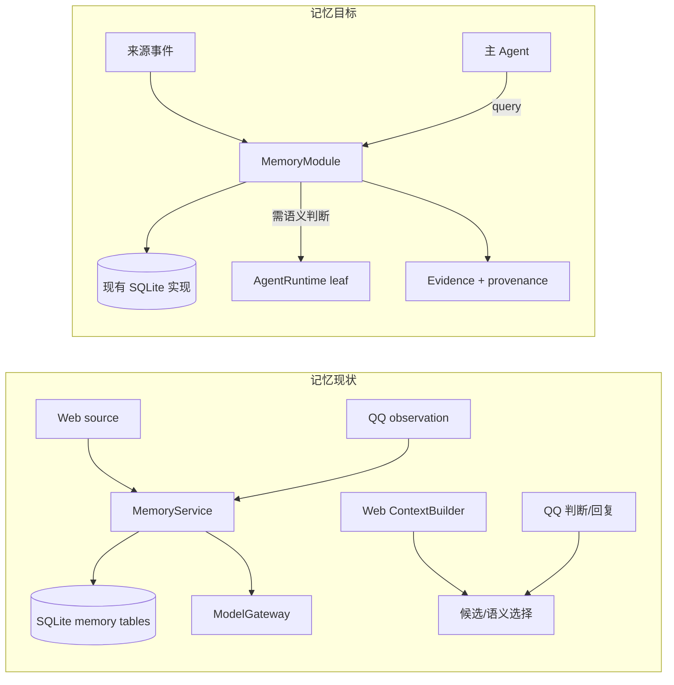
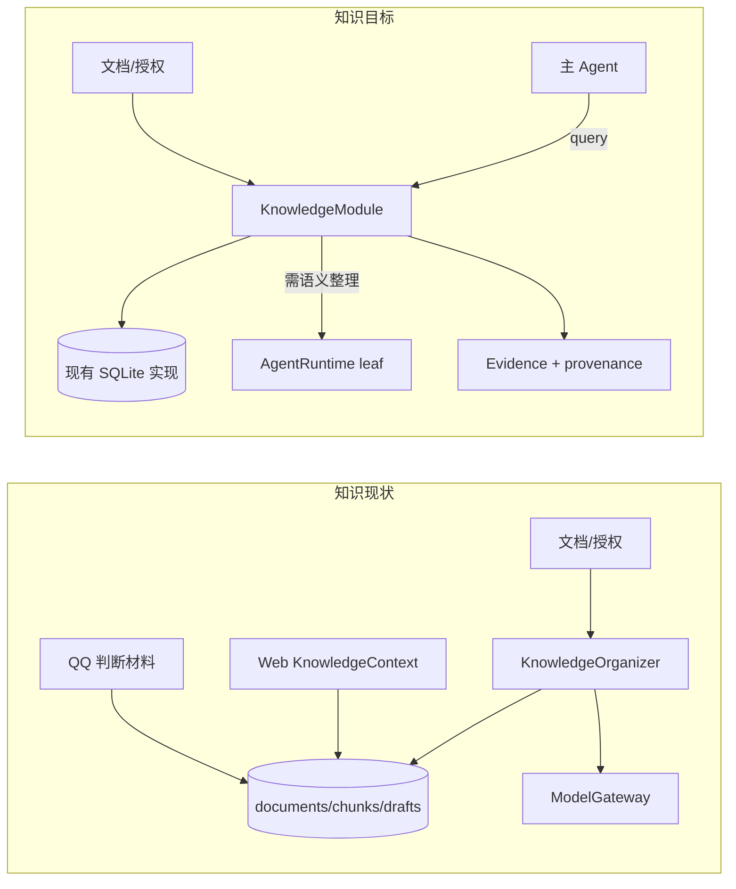
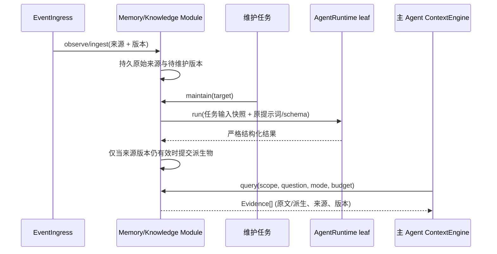

# 记忆与知识：轻量模块边界

> 设计方案；源码基线 `d3167e4`。[总览](./README.md) · [Agent 协议](./02-Agent运行与上下文协议.md)

## 1. 为什么边界停在模块级

当前记忆和知识不只是向量库/关键词库：记忆含来源观察、四种类型、作用域、人工纠正、整理与六种读取模式；知识含文档导入、授权、整理稿、来源映射及在线候选。把摄入、切块、索引、排序等当前步骤都规定为必经插件接口，会把今天的实现误当成未来所有后端的通用形状。[现有记忆](/Users/nkanf/clones/superstring/src/server/services/memory-service.ts:314) · [知识整理](/Users/nkanf/clones/superstring/src/server/services/knowledge-organizer.ts:8) · [在线知识](/Users/nkanf/clones/superstring/src/server/services/knowledge-context.ts:76)





## 2. 共同外部语义，内部算法仍由模块决定

```ts
type Evidence = {
  id: string;
  text: string; // 给当前文本模型的可渲染投影；不限定来源本体的数据形态
  source: { kind: "memory" | "knowledge"; id: string; revision: string };
  scope: string;
  relevance?: number;
  expiresAt?: number;
};
interface MemoryModule {
  query(input: MemoryQuery): Promise<readonly Evidence[]>; // 带作用域与预算
  observe?(source: SourceEvent): Promise<void>;             // 可选摄入能力
  maintain?(target?: string): Promise<MaintenanceResult>;  // 可选维护能力
}
interface KnowledgeModule {
  query(input: KnowledgeQuery): Promise<readonly Evidence[]>;
  ingest?(source: KnowledgeSource): Promise<void>;
  maintain?(target?: string): Promise<MaintenanceResult>;
}
```

`query` 是消费侧的最小能力；摄入和维护是可选能力，宿主只在模块声明支持时向对应管理流程提供操作，不让只读后端实现空方法。这些动词不要求每次 `observe/ingest` 都立刻切块或调用模型，也不要求模块内部可互换每个中间阶段。替换一个后端时保留来源身份、授权、查询语义和删除语义即可；实现可选“整篇”“分段”“图”或远程服务。`Evidence.text` 是当前文本模型的渲染投影，不要求图/媒体知识的原始本体被压平成字符串。主 Agent 只接触证据和查询参数，不知道具体表、分词或 chunk。`source` 与 `revision` 让引用、撤权、重建和 ContextHandle 失效可追踪。

## 3. 现有行为迁移

| 现状 | 拟改 | 预期与验收 |
| --- | --- | --- |
| Web 配对轮次、QQ 观察分别生成来源；整理可修订已存条目。[来源](/Users/nkanf/clones/superstring/src/server/db/memory-source-repository.ts:1) | 现有来源仓储在 `MemoryModule.observe` 内保留，接收统一 `SourceEvent` 中的原来源 ID、会话作用域和订正信息；维护时机仍可配置。 | 既有条目、来源修订、人工纠正可读；重复摄入不产生第二份。 |
| 记忆四类元数据、四类作用域、六种读取模式及关键词候选/语义选择各有既定策略。[现状 Wiki](/Users/nkanf/docs/superstring/03-记忆与知识检索.md) | 原样封装到内建 `MemoryModule`；查询参数明确 `scopes/query/mode/budget`。语义选择由 `leaf` Agent 执行，结果只允许候选 ID，严格检验。 | Web 模式无降级；QQ 可使用相同完整查询接口，现有预算先以会话配置表达并用真实样例调优。 |
| 知识导入原文、分段、整理稿与授权；Web 有语义选择，QQ 判断材料简化。[知识仓储](/Users/nkanf/clones/superstring/src/server/db/knowledge-repository.ts:195) | 现有分段/整理保留为 `KnowledgeModule` 的首个实现；`query` 返回同一证据格式；授权在模块查询与 ContextHandle 检查时生效。 | 现有知识管理界面、授权撤销、原文/整理稿与来源映射不丢；QQ 也可在统一查询边界上启用知识能力。 |
| 记忆整理和知识整理自己直接调 `ModelGateway`。[记忆](/Users/nkanf/clones/superstring/src/server/services/memory-service.ts:403) · [知识](/Users/nkanf/clones/superstring/src/server/services/knowledge-organizer.ts:233) | 原提示词、JSON schema 与解析约束变成版本化的 `leaf AgentSpec`，经 `AgentRuntime` 调模型；模块仍负责版本/lease/事务写入。 | 所有模型步骤有统一运行记录；任务结果和旧数据兼容，资料模块无需自己实现模型重试/路由。 |

## 4. 摄入、维护、消费的时序



维护模型的上下文是本次来源与任务模板，不默认继承主 Agent 的对话历史；本轮只暴露 `ContextHandle`，以后若要显式共享，再由外层授权预处理函数选择。运行中的资料若更新：可以让下一模型步骤重新查询；出站提交时只需核对**输出依赖的授权与相关会话序列**，不要对整库做重复指纹检查。来源撤销与删除须使新查询不可见，并清掉或过期包含该来源全文的运行快照。[ContextHandle](./02-Agent运行与上下文协议.md#5-contexthandle可查看的运行输入而非通行证)

## 5. 明确保留的边界

- 本轮不引入向量数据库、不强制改掉已有关键词候选与排序；语义候选仍有用，但通过同一 `leaf` 协议运行。优化效果要用固定查询样例对比召回、排序、成本与延迟。
- `KnowledgeSource` 可以是整篇文本；现有 1536 字节离线分段与约 768 字节在线片段只是首个实现，不成为接口要求。[现状 Wiki](/Users/nkanf/docs/superstring/03-记忆与知识检索.md)
- 记忆/知识授权与作用域是数据边界；它们必须留在查询和引用层，不能仅靠 prompt 约束。内部重复的候选合法性/版本检查应审查删并，只保留外部数据、受权和提交边界的必要检查。
- 第三方后端是接口可替换性的验收方式，可用测试替身验证，但不在本轮实现远程后端、插件注册表或一组细分 Provider。
