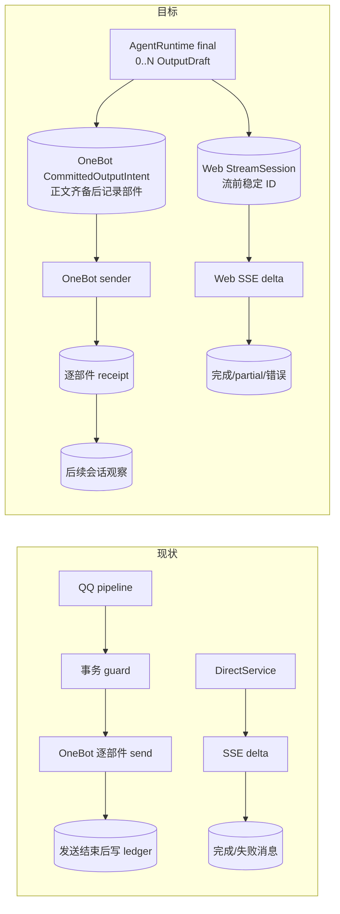
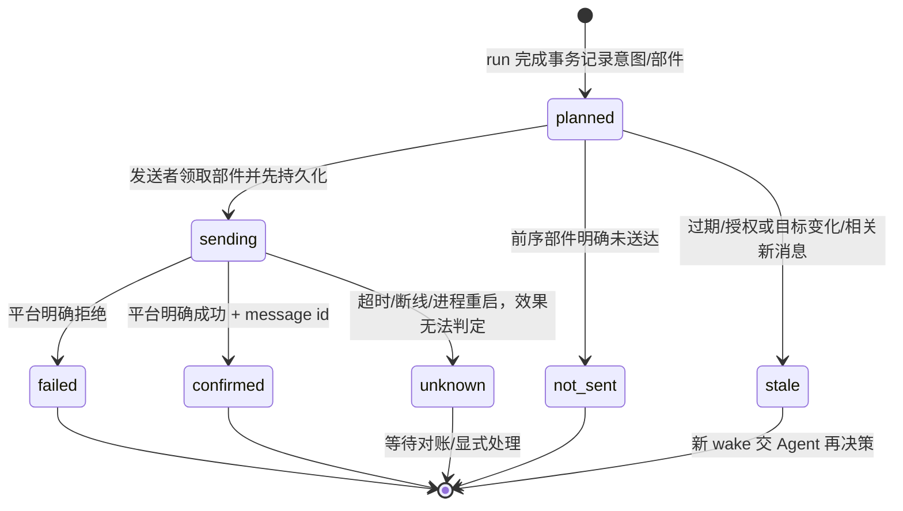

# 输出投递与故障恢复

> 设计方案；源码基线 `d3167e4`。[总览](./README.md) · [Agent 输出协议](./02-Agent运行与上下文协议.md#3-可落地的模型动作协议)

## 1. 现状 → 改动 → 预期

| | 内容 |
| --- | --- |
| 现状 | Web `DirectService` 先准备 turn，再 SSE 输出 `start/delta/done/error`；断连/失败记录部分文本，完成时带 generation token 保存。[源码](/Users/nkanf/clones/superstring/src/server/services/direct-service.ts:97) QQ 在发送前有事务授权，但 `qq-send-transport` 逐个网络发送部件，**全部调用结束后才**写发送账本；崩溃于网络请求与账本写入之间会失去准确回执。[源码](/Users/nkanf/clones/superstring/src/server/services/qq-send-transport.ts:102) |
| 改动 | Agent `final` 产生 0..N 个目标明确的 `OutputDraft`。Web 在正文流之前记 `StreamSession`，完成后才提交消息；OneBot 在每条正文齐备后、网络发送前持久化 `CommittedOutputIntent` 与部件，逐部件更新结果。`unknown` 不当作失败重发。 |
| 预期 | 模型推理与网络副作用边界分明；多收件人、多部件状态可恢复；不谎称外部网络调用和 SQLite 可以原子提交。 |



## 2. 输出意图和受众

```ts
type OutputDraft = {
  target: { kind: "request" | "private" | "group"; peerId?: string; mentionIds?: string[] };
  body: { kind: "inline"; text?: string; stickerId?: string } | { kind: "generate"; instruction: string };
};
type CommittedOutputIntent = {
  id: string;                  // runId + output ordinal，重试稳定
  runId: string;
  conversationId: string;
  channel: "onebot11";
  target: OutputDraft["target"];
  content: { text?: string; stickerId?: string; mediaRefs?: string[] };
  sourceThroughSeq: number;    // 草稿依赖的本地事件上界
  deliverBy: number;           // 会话配置给出的有效期，非永久补发
  status: "planned" | "delivering" | "confirmed" | "failed" | "unknown" | "stale";
};
type StreamSession = { outputId: string; runId: string; clientRequestId: string; status: "streaming" | "completed" | "failed" | "cancelled"; partialText?: string };
```

Agent 可以决定“不说话”或一轮面向多人产生多条输出；每条草稿有自己的目标和正文，`generate` 草稿逐条调用模型。Web 一次请求只允许一个流式草稿。OneBot 适配器把模型的目标意图编码为平台私聊/群聊/@ 段；模型不得直接构造未经许可的平台 ID/CQ 控制码。真实平台地址仍由绑定事实和发送端校验得到。`OutputDraft → 渠道投递状态` 是内核与渠道之间的边界；Web 的流会话和 OneBot 的已提交意图**有不同持久化时刻**，不能强行共用一张状态表。用户可在运行诊断里看到清晰的投递结果。

OneBot 的多目标草稿逐条得到 `prepared/failed/blocked` 局部结果；某条正文生成失败或目标被阻止，只记录并舍弃这一条，其余照常提交与发送。只有整轮目标事实发生相关变化才回到 Agent 再决策；不要因为单条失败把所有目标一并丢掉。[当前逐目标行为](/Users/nkanf/clones/superstring/src/server/services/qq-initiative-cycle.ts:89)

## 3. OneBot 逐部件状态机



提交边界：同一数据库事务检查会话 run 所有权及**相关输入序列/授权**，写入 run 终态、消费 wake、稳定的消息意图及部件行；事务外才调用 OneBot。`planned` 在重启后可领取，但领取时仅做一次有效期 `deliverBy`、目标/授权及相关新消息检查；已过时的意图标 `stale`，产生新 wake 让 Agent 决策，不能隔数小时补发旧话。当前 QQ 即时任务已有约 600 秒接纳窗口，具体新时效由会话配置设定而非写死。[当前即时窗口](/Users/nkanf/clones/superstring/src/server/services/qq-dispatch.ts:185) `sending` 崩溃或网络超时记为 `unknown`。**绝不自动把 `unknown` 重发。** 若平台允许可靠按消息 ID/echo 查询，适配器可以对账更新为 `confirmed/failed`；否则通过实际群聊观察或操作界面明确处理。没有可证明的外部幂等键时，不能承诺“恰好一次”。

每条消息按当前计划的发送顺序发部件；一条文本已确认而贴图失败是合法的部分成功；文本没有送出则贴图按既有规则 `not_sent`。每个部件一条单独状态及平台回执，和当前逐部件事实保持一致。[当前发送计划](/Users/nkanf/clones/superstring/src/server/services/qq-send-transport.ts:102) 一轮多收件人也逐条保留状态，不能把全部发送变成一个模糊 boolean。新的 pre-send 意图行是**新增的可靠性语义**，旧账本并不天然拥有它；迁移时原账本保留且作为已发历史读视图，新意图只覆盖切换后的投递。

已确认的 OneBot 消息进入会话日志，作为下一次 Agent 激活可见的“自己发过什么”事实；unknown 也作为状态事实可见，但不冒充已发送或未发送。回执不把刚完成的 run 重新打开。消息发送前用一次版本/权限/目标检验；模型阶段和发送前重复读取的纯派生条件应按必要性删除，避免当前多层 preflight 机械搬迁。[当前预检](/Users/nkanf/clones/superstring/src/server/services/qq-send-preflight.ts:1)

## 4. Web 流会话

Web HTTP 继续按 `clientRequestId` 先 `prepareTurn`，此时会返回会话/冲突类 **JSON HTTP 错误**，然后才建立 SSE。[当前时序](/Users/nkanf/clones/superstring/src/server/services/direct-service.ts:97) 当主 Agent 的决策步给出 `final`，创建稳定的 Web 输出 ID，随后 `streamText` 一边生成一边发 `delta`。流未完成时不把正文标成成功；完成后持久化全正文、生成 `done`。断连或模型错误按当前 API 保留 partial/error；同请求已完成则 replay，不重新运行模型。SSE `start` 在 route 中先发，`done` 只在成功提交后发。需要在 PR 2 做浏览器断开/取消、租约失效和重复请求的真实验证。

Web 流式发送给浏览器属于不可收回的显示副作用；不能用“先完整生成再提交”代替流。若运行中发现新的相关输入或丢失所有权，在发出 `delta` 前可重新决策；一旦开始发出 `delta`，本条响应的文本不能重写，只能完成或按现有 partial/error 结束，并把新消息留给后续 run。这是 Web 与 OneBot 共同输出协议下的渠道事实差异，不是两套 Agent Loop。

## 5. 恢复矩阵

| 崩溃/失败位置 | 持久事实 | 恢复动作 |
| --- | --- | --- |
| 模型决策或内建只读查询中 | wake/run 尚无外部意图 | 释放/到期 lease 后按配置重试；不推进观察游标。 |
| run 完成事务前 | 无意图 | 旧 run 作废，保留 wake 和新事件；重新运行。 |
| run 完成事务后、OneBot 部件发送前 | `planned` | 按稳定意图 ID 领取；仍在 `deliverBy` 内且目标/授权/相关消息未变才发送，其他标 `stale` 并重新唤醒 Agent。 |
| OneBot 标记 `sending` 后、明确回执前 | `sending` | 重启标为 `unknown` 并对账；无证据不重发。 |
| 某些部件已确认、后续失败 | 逐部件结果 | 不重发已确认部件；后续部件按既有依赖规则 `failed/not_sent`。 |
| Web 已流部分文本后断连 | partial + failed/cancelled | 终止模型流，保留 partial；按当前请求幂等规则处理重试，不把 partial 当成功回复。 |

保留当前取消/租约机制中真正防止旧写者覆盖新写者的检查；删除仅重复确认同一个确定性派生值的层层校验。对外状态必须说真话：`confirmed` 有回执证据，`unknown` 只是无法判断。[当前 Web 租约](/Users/nkanf/clones/superstring/src/server/services/direct-service.ts:150) · [当前 QQ 提交](/Users/nkanf/clones/superstring/src/server/services/qq-dispatch-cycle.ts:261)
