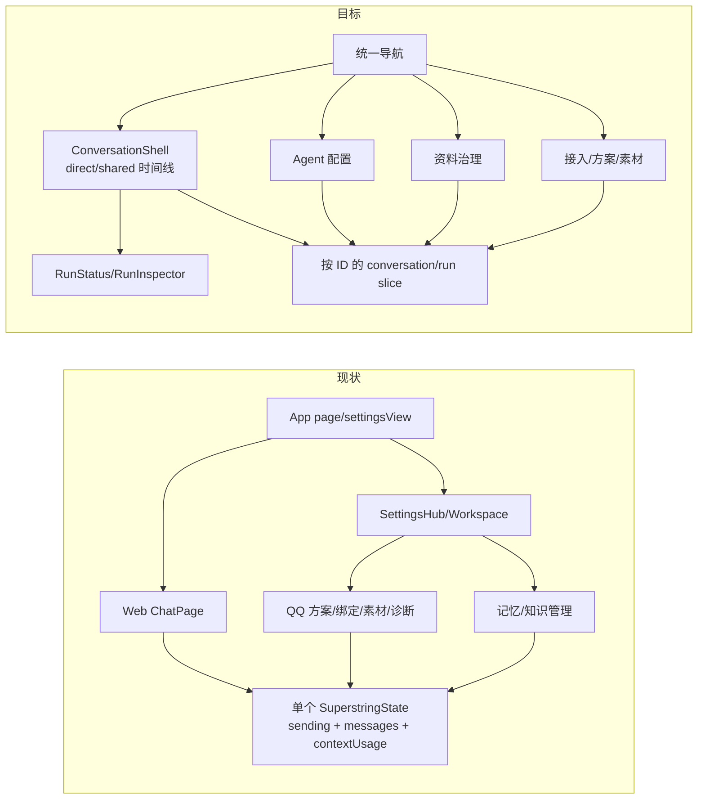

# 前端 UI/UX 与状态架构

> 由独立前端 UI/UX 子代理审查源码形成，主方案整理；基线 `d3167e4`，未做运行时视觉验收。[总览](./README.md) · [逐文件计划](./07-逐文件实施计划.md)

## 1. 现状 → 改动 → 预期

| | 内容 |
| --- | --- |
| 现状 | 页面壳是 `chat/settings`，设置内部用 `settingsView/settingsRoute` 手写分派；一个 Zustand 状态组合聊天、Agent、知识、QQ 与各种编辑草稿。聊天只持一份 `messages/contextUsage` 和全局 `sending`。[App](/Users/nkanf/clones/superstring/src/web/App.tsx:31) · [状态](/Users/nkanf/clones/superstring/src/web/state/types.ts:29) · [路由](/Users/nkanf/clones/superstring/src/web/app/settings-routes.ts:1) |
| 改动 | 前端使用同一 `ConversationSummary/RunEvent/OutputSummary` 读模型；按 `conversationId/runId` 管理运行状态，按功能拆 Zustand slice；在现有品牌和组件体系中重排导航。普通界面用用户可懂的状态，高级运行详情可看步骤/资料/ContextHandle。 |
| 预期 | Web/OneBot direct/shared 同一会话时间线；前端能解释“正在处理”“本次未发言”“发送结果待确认”，保留全部现有管理能力。 |



## 2. 现有功能必须完整迁移

| 现有页面 | 当前能力与源码 | 新位置/行为 |
| --- | --- | --- |
| 聊天 | Web 新会话/选择 Agent、发送/同请求重试、上下文用量；当前 UI **没有取消生成按钮**，后端存在取消/断连状态。[ChatPage](/Users/nkanf/clones/superstring/src/web/features/chat/ChatPage.tsx:228) · [用量面板](/Users/nkanf/clones/superstring/src/web/features/chat/ContextUsagePanel.tsx:45) | `对话` 中 Web 可输入；OneBot direct/shared 可看观察与已发消息，默认只读。用量保留，关联当前 run。 |
| Agent/模型 | 创建、启停、删除；Agent 页面有对话、记忆读取/整理、压缩等模型用途；QQ 判断模型目前是 QQ 全局设置，QQ 方案提示词也按方案共享；知识整理为知识全局用途。[AgentSettings](/Users/nkanf/clones/superstring/src/web/features/agents/AgentSettings.tsx:65) · [编辑器](/Users/nkanf/clones/superstring/src/web/features/agents/SettingsPageEditor.tsx:91) | `Agent` 展示身份/表达、运行/模型用途、上下文与读取配置；旧用途字段按原有作用域投影到主/leaf AgentSpec，显示“全局/方案/Agent 自定义”的生效来源与优先级。QQ 全局判断模型、方案提示词不得物理复制到每个 Agent；不能只留一个全局模型下拉。 |
| 记忆 | 分区、Web 轮次手工整理、搜索分页、合并/屏蔽/启用/永久删除、纠正及 QQ 定时/立即整理。[SectionB](/Users/nkanf/clones/superstring/src/web/features/memory/SectionB.tsx:125) · [纠正](/Users/nkanf/clones/superstring/src/web/features/memory/MemoryCorrection.tsx:6) | `资料 → 长期记忆`，保留治理操作；标注来源、作用域、维护运行和状态。 |
| 知识 | 分类、txt/md/粘贴导入、原文/整理稿与来源、逐篇/批量授权、读取范围预算。[KnowledgeSettings](/Users/nkanf/clones/superstring/src/web/features/knowledge/KnowledgeSettings.tsx:73) · [编辑器](/Users/nkanf/clones/superstring/src/web/features/knowledge/KnowledgeEditor.tsx:41) | `资料 → 知识库`，保留完整编辑/授权；整理/检索状态与 RunInspector 关联。 |
| OneBot 接入 | 连接/令牌、群私聊绑定（含未观察会话）、暂停/触发、重要人物、四触发方案/节奏/窗口/输出预算/分人回复/媒体贴图/提示词、存储诊断。[接入](/Users/nkanf/clones/superstring/src/web/features/qq/QqAppAccess.tsx:52) · [方案](/Users/nkanf/clones/superstring/src/web/features/qq/SchemeSettings.tsx:59) · [诊断](/Users/nkanf/clones/superstring/src/web/features/qq/QqStorageSettings.tsx:21) | `接入` 分连接、绑定、唤醒与发言策略、素材、活动与存储；字段映射可编辑且有变更预览，不能“统一架构”后删除旧控制。 |

当前 QQ 知识设置的说明应精确指明作用阶段：现代码 QQ 判断材料可取知识候选，但 QQ 回复链没有同一知识读取能力。[判断材料](/Users/nkanf/clones/superstring/src/server/services/qq-judgement-material.ts:150) · [回复链](/Users/nkanf/clones/superstring/src/server/services/qq-reply-runner.ts:1) 迁移后若启用主 Agent 知识查询，再更新文案和实际行为，不能先写“QQ 回复已经使用知识”。

## 3. 信息架构与关键界面

建议一级导航：**对话、Agent、资料、接入、偏好**。`对话` 依会话拓扑显示参与者、寻址关系和平台标识；群聊是一条多人时间线，不能用一个“对方”头像代表全群。旧 QQ 方案移到接入策略，但保留字段与可编辑提示词，过渡期间同一参数只有一个可写来源，旧 API 读视图可兼容。设置导航必须继续保护未保存草稿和变更预览。[当前设置导航](/Users/nkanf/clones/superstring/src/web/app/SettingsSidebar.tsx:84) · [草稿保护](/Users/nkanf/clones/superstring/src/web/App.tsx:41)

```text
桌面： [导航/会话] | [会话时间线：Agent、渠道、参与者、状态] | [按需运行详情]
                     [Web：输入框 + SSE；OneBot：只读观察 + 唤醒/送达]

运行详情：概览 → 关键步骤 → 所用记忆/知识 → 上下文用量 → 高级“实际输入”
接入页面：连接状态 | 群/私聊绑定 | 唤醒/发言策略 | 素材 | 活动/送达/清理
窄屏：顶部会话切换；主内容满宽；运行详情独立页或抽屉。
```

普通视图使用 `等待 / 正在准备 / 正在回复 / 正在送达 / 已完成 / 本次未发言 / 失败 / 发送结果待确认`。`no_output` 是群聊合法结果，放在活动详情，**不在聊天时间线造空消息气泡**。`unknown` 只能提示“待确认/对账”，不能提供普通“立即重发”按钮。高级详情才呈现 Agent 决策、检索、压缩、重新判断、来源 scope 和 step。现有上下文用量面板仅展示模型、预算与组成元数据；精确 prompt 应在 RunInspector 里手动请求与展开，不塞进 SSE 或默认列表。[当前用量 DTO](/Users/nkanf/clones/superstring/src/shared/contracts/context-usage.ts:4)

## 4. 数据合同与状态管理

```ts
type RunEventEnvelope = { runId: string; conversationId?: string; seq: number; at: string };
type ConversationSummary = { id: string; topology: "direct" | "shared"; channel: string; participants: ParticipantRef[] };
type RunSnapshot = { runId: string; conversationId?: string; status: string; lastSeq: number; outputs: OutputSummary[]; contextHandle?: ContextHandle };
```

`seq` 在一个 run 内递增，客户端以 `(runId,seq)` 去重；入站会话事件的本地 `seq` 是另一个序列，两者不可混用。`outputId/messageId` 连接增量、落库回复和投递结果。`GET /v2/runs/:id`/消息状态是断线重连的权威快照：SSE 到 EOF 但无 `completed/no_output/failed/cancelled` 时，前端显示“连接中断，正在核对结果”，查询后再决定完成或错误，不能把 EOF 当成功。[当前 SSE 读取](/Users/nkanf/clones/superstring/src/web/api.ts:457) 原 `/chat` SSE 的 `start/delta/done/error/context` 是 strict schema，**帧形状不变**；PR 2 新增 `/v2/chat` 承载 RunEventEnvelope，新前端使用 v2，旧客户端继续用旧协议。若新连接在首帧前断开，以 `sessionId+clientRequestId` 查询 run ID，再查终态；不能盲重发。[当前协议](/Users/nkanf/clones/superstring/src/shared/contracts/chat.ts:34)

前端继续用 Zustand，不引入另一套全局状态机库。把 `conversationById`、`runById`、`settingsDraftByKey` 分为领域 slice，`RunEvent` 经单一 reducer 合并；OneBot 送达状态从 `GET /v2/deliveries/:outputId` 读取，与 run `completed` 分开；可见会话通过 `GET /v2/conversations/:id/events?afterSeq=` 增量刷新，详情按需获取。[目标 API](./07-逐文件实施计划.md#5-新查询-api-与旧协议并存) 所有异步更新带 ID，避免当前全局 `sending` 让一个会话的请求锁住其他会话。[当前全局状态](/Users/nkanf/clones/superstring/src/web/state/types.ts:162) 草稿导航保护统一一处，但保存/放弃/变更预览保持旧行为。`ContextInspect` 作为按需 API；对 `exact/partial/expired/revoked` 显示不同状态，`partial` 要说明图片字节不可重取但来源/hash 尚在；过期/撤权后清理浏览器缓存中的原文。

记忆/知识维护页用原任务 ID 查询 `GET /v2/runs?ownerKind=memory_job|knowledge_job&ownerId=...`，旧任务 DTO 可附 `latest_run_id`。同一任务重试会有多条 run，UI 显示最新尝试并可展开前次错误；不能只显示无来源的“整理失败”。[运行归属表](./08-迁移与验收.md#1-迁移原则与表结构)

## 5. 可访问性、响应式与三个 PR

沿用现有 `ProcessingStatus` 的礼貌状态播报，但只播相位变化，不逐字播报 delta。[当前组件](/Users/nkanf/clones/superstring/src/web/ui/ProcessingStatus.tsx:1) 新会话浮层迁为真正 dialog，处理初始焦点、Tab、Esc 和关闭后的焦点归还；参考 [W3C APG 模态对话框模式](https://www.w3.org/WAI/ARIA/apg/patterns/dialog-modal/)。现有窄屏 CSS 会把侧栏移到顶部，[样式](/Users/nkanf/clones/superstring/src/web/styles.css:2452)；新版用可关闭导航和运行详情抽屉，验证 320px/200% 缩放、键盘顺序与减弱动画，参见 [WCAG Reflow 说明](https://www.w3.org/WAI/WCAG22/Understanding/reflow.html)。

| PR | 前端改动 | 验收 |
| --- | --- | --- |
| 1 | typed run/ContextInspect API，按 ID 的 run slice；Agent/记忆/知识模型用途映射；保留当前页面。 | 所有旧设置与资料治理可打开/保存，继承/单独指定模型显示准确。 |
| 2 | Web/direct 会话按 ID 处理 SSE，RunInspector 首版，OneBot 私聊只读时间线；断流对账。 | 乐观发送、增量、用量、同 ID replay、权限变化后的新请求、切会话不互相干扰。用户取消按钮若加入则按新增能力验收。 |
| 3 | shared 群聊时间线、唤醒/未发言/投递活动；接入设置重新编组，完整保留方案/素材/诊断。 | @、跟进、主动、冷场、分人回复、贴图/媒体、绑定、暂停、限额、记忆整理和知识授权都有准确状态与操作入口。 |

三个 PR 各自包含对应前端改动与回归，不把 UI 适配另推到第四个“以后再做”的 PR。视觉完成判定需要在实际浏览器/桌面窗口检查，不以组件单测代替。[完整验收矩阵](./08-迁移与验收.md)
