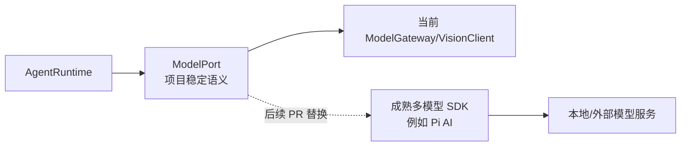

# 重构后的标准协议与成熟模型适配层

> 此页是**重构范围以外的独立后续 PR**。三个核心重构 PR 只做可用的接口出口，不提前实现工具/Skills/MCP，不为了预想后端写一套空框架。[总计划](./README.md)

## 1. 现状 → 本轮留口 → 后续扩展

| | 内容 |
| --- | --- |
| 现状 | `ModelGateway` 自己处理 LM Studio/OpenAI 兼容请求、外部模型路由、结构化输出回退、SSE、容量和错误映射；`VisionClient` 独立。[模型网关](/Users/nkanf/clones/superstring/src/server/llm/model-gateway.ts:82) · [视觉](/Users/nkanf/clones/superstring/src/server/llm/vision-client.ts:1) |
| 重构内 | 建**已可运行**的 `ModelPort`：`next` 结构化决策、`streamText`、视觉请求、模型容量/取消。现有网关作为首个实现。接口旁记录 TODO：以后可由成熟多模型库/标准协议适配器替换传输实现；AgentRuntime 不导入具体 SDK 类型。 |
| 后续独立 PR | 比较并接入成熟实现，例如 Pi 的多模型接口；在 `ModelPort` 后面替换 provider 适配层，或在验证语义等价后再考虑更换更大的 Agent 核心。 | 

用户提及的名称可理解为 Pi 系列模型接口的方向，但**本页不把听写名称当成已确认依赖**。Pi 官方文档说明其模型层可复用已有 OpenAI Chat/Responses、Anthropic 等协议实现，对 LM Studio 这类兼容端点可走配置；这使其成为合理候选，不代表已经验证 Superstring 的结构化输出、容量/视觉和错误行为都匹配。[Pi 自定义 Provider](https://pi.dev/docs/latest/custom-provider) · [Pi 兼容端点](https://pi.dev/docs/latest/models)

## 2. 候选库接入的边界

`ModelPort` 的项目语义包括：结构化决策验证、文本 delta/终态、调用方取消、实际加载上下文容量、模型 ID/鉴权路由、可诊断错误。库可以提供 provider/stream/tool-call 能力，但不能替代 `ConversationHost` 的会话串行、唤醒持久化、Memory/Knowledge 授权或 OneBot 出站账本。若要直接采用成熟 **Agent core** 而非只换 LLM 适配，必须证明它能承载本方案的本地事件序列、ContextHandle/保留期、Web SSE partial、Bot wake 与逐部件 unknown；否则只换 ModelPort 的后端，避免系统同时存在两个 loop。

后续 PR 的候选验收：

1. 在相同模型与输入上对照结构化 JSON schema、回退、非法结果和流式终态；不因库支持工具调用就取消本轮 `next/final/none` 语义。
2. 本地 LM Studio、当前外部 provider、视觉/媒体、加载容量探测、认证和错误码保持；关闭连接、超时、用户取消都能中止上游请求。
3. 量首字延迟、额外决策调用成本、内存与重连行为；完成真实 Web SSE/OneBot 冒烟。
4. 前端模型列表/用途设置只看到同一模型身份与可用性，不暴露底层 SDK 名称。

本 PR 不强迫修改现有 Agent 数据库表；若需持久 provider 元数据，单独迁移并附旧配置映射。该 PR 与前三个核心 PR **分开评审、分开回滚**，可以在核心稳定后进行。未来工具、Skills、MCP 再各自按需求评估，不在本次的标准模型适配 PR 中偷渡实现。[当前工具/Skills 边界](/Users/nkanf/docs/superstring/05-工具调用与Skills.md)
