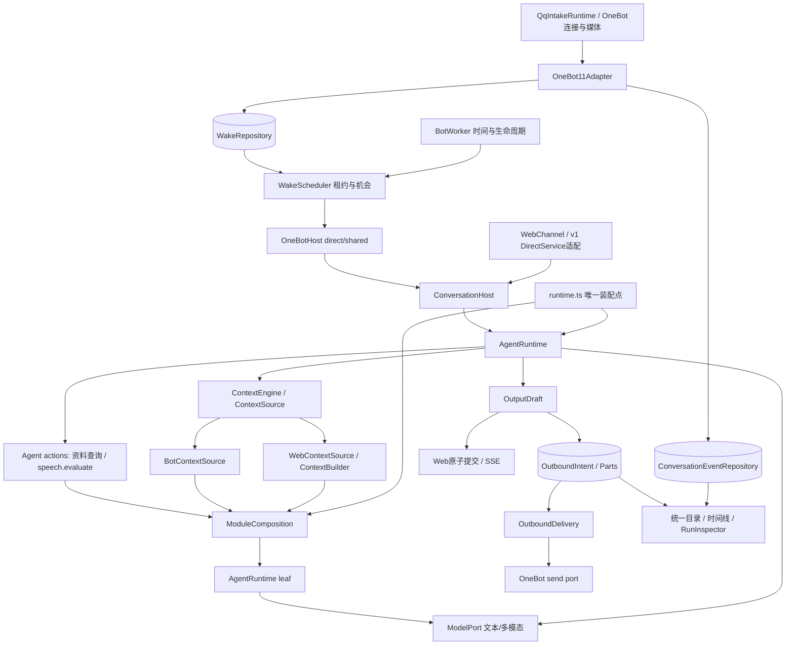

# 已实现架构与功能证据

实现基线：`d3167e4`；整合源码：`8fad8f0`，2026-09-26。本文描述三阶段实现；01–11 保留设计时的现状/目标与评审过程。**现有功能只允许等价迁移或增强，不能简化、降级或遗漏。** 合成模型回归不等于真实模型质量验收。

## 1. 生产调用图

主运行是可迭代 `invoke / final / none` 协议；单轮整理/筛选/压缩/媒体任务共用 leaf 入口和运行记录。宿主负责来源与发送事务，模型不会获得直接提交数据库或发送网络消息的权限。Web 与 Bot 的传输、时机和上下文呈现不同，但没有独立的第二套模型执行循环。

## 2. 实际代码地图

| 目录/文件 | 当前职责 |
| --- | --- |
| `src/server/runtime.ts`、`app.ts` | 装配唯一 AgentRuntime、会话宿主、资料模块、Web API、Bot 生命周期；停止时先阻止下一次发送，完成在途回执再关闭数据库。 |
| `agent/agent-runtime.ts`、`model-port.ts`、`agent-specs.ts` | 统一循环、leaf、模型端口、运行配置；模型调用与可读运行记录。 |
| `agent/context-engine.ts`、`context-access.ts` | ContextView/Handle、预算、来源版本与读取授权；同一自定义来源 resolver 贯穿生成、发送和诊断。 |
| `agent/conversation-context.ts`、`conversation-compression.ts`、`summary-contract.ts` | Web 历史装配/既有压缩持久化；共享摘要结构。 |
| `channels/web-channel.ts`、`web-context-source.ts` | turn/request 所有权、SSE、partial、消息/日志/run 终态事务；v1 API 兼容。 |
| `channels/onebot11/{adapter,bot-host,context-source,create-runtime}.ts` | 协议事实、统一 Bot 主 Agent、共享资料与压缩、生产发送装配；direct/shared 通过目标与触发规则配置。 |
| `conversation/{bot-worker,wake-scheduler,observation-relevance}.ts` | 轮询与唤醒、持久租约、全局并发、观察相关性。定时器不调用模型。 |
| `conversation/{outbound-delivery,conversation-view}.ts` | 逐部件投递和动态读视图；unknown 不自动重发，过期内容不从日志还原。 |
| `modules/contracts.ts`、`composition.ts` | 模块级 query 与可选 observe/ingest/maintain；默认 SQLite 实现复用原维护 worker；不规定所有后端必须切块。 |
| `modules/initial-evidence.ts` | 旧初始资料格式/知识冻结协议的兼容适配；替代模块可以直接返回 Evidence，不需要构造 SQLite MemoryItem。 |
| `modules/{memory-module,memory-query,knowledge-module,provenance}.ts` | 默认后端的六模式读取、选择、来源映射；模型辅助工作走 AgentRuntime。 |
| `db/{agent-run,conversation-event,wake,outbound-intent}-repository.ts` | 运行、会话、唤醒、发送事实；原 Web/记忆/知识/QQ 表仍是各自正文和业务事实来源。 |
| `services/{memory-service,knowledge-organizer}.ts` | 原整理事务、游标、租约、人工治理语义；生命周期和消费从模块装配接入。 |
| `services/qq-intake.ts`、媒体/贴图/提示词纯函数 | OneBot transport、原始观察与媒体理解、发送编码等具体实现。QQ 命名的业务辅助函数仍在，旧固定主流水线已退出生产图。 |
| `src/web/features/conversations` | 唯一会话目录、分页与选择、direct/shared 时间线。 |
| `features/chat`、`features/runs` | 会话独立请求/草稿/用量/恢复；运行步骤与按需上下文诊断。 |
| `features/qq`、`app/app-routes.ts` 等 | 资源归属草稿、九个连续方案分区、保存/放弃/取消、真实运行诊断与旧历史诊断。 |
| `tests/fixtures/legacy-qq` | 旧固定流水线测试 oracle，保留原行为断言；无生产 import。其测试数量不能当作新宿主覆盖数量。 |

## 3. 兼容与增强如何验证

| 功能 | 保留/增强 | 证据入口 |
| --- | --- | --- |
| 六种记忆模式、选择模型、预算 | 初始装配继续生效，Agent query 可追加读取；Web frozen knowledge 与原格式保留。 | `memory-unification`、`module-composition`、`knowledge-context`、`context-builder`、`bot-context-source` |
| Web 历史与压缩、流式 partial、刷新恢复 | 既有行为进入同一主 Loop；查询短暂失败后的已完成消息可恢复，不再次发送 POST。 | `conversation-v2`、`chat-v2`、既有 direct/SSE 测试 |
| Bot 四条发言路径、分人/不分人 | 一个 OneBotHost；打分使用全局判断模型，生成使用 Agent 模型；同名成员按 ID 区分。 | `onebot-private-host`、`onebot-shared-host`、`runtime-onebot-direct` |
| 新到消息/媒体、复核与重算次数 | 扫描相关新增来源，不只看最后一条；保留配置次数；迟到媒体修订保留原消息时间，不刷新 600 秒即时机会。 | `onebot-shared-host`、`qq-event-path`、`runtime-onebot-recovery` |
| 字幕/图片/语音/动图、贴图与 CQ | 保留原模型/提示词、候选/去重/授权、单图输出、逐部件发送及兼容事实。 | 既有媒体/贴图 suite + 新 private/shared/delivery 测试 |
| 多收件人与 unknown | 每目标独立意图；一个失败不吞其他输出；全失败不能伪装 no_output；停机不消费尚未开始的发送。 | `onebot-private-host`、`onebot-shared-host`、`runtime-onebot-recovery` |
| 记忆/知识治理与维护 | 原整理源、人工更正、授权、版本、回滚、导入与 UTF-8 校验保留；摄入通知消费已提交来源。 | 既有 memory/knowledge suites + `runtime-module-wiring` |
| 现有管理 UI | 字段与入口均保留；统一五分区导航；无效数字草稿/部分保存/取消仍可见。 | 470 个前端回归 + `verification/pr3-frontend` 实际浏览器证据 |

现状修正：旧 QQ 兴趣打分阶段曾无视记忆 `off`，自行注入固定预算关键词片段；现在沿用已配置模式和统一资料装配，`off` 才表示关闭。此项是配置语义一致性的修正，不宣称提示词或候选逐字相同。原始近期窗口/count 仍保留；新增 Bot 压缩只使用剩余预算补充原来被 token 预算排除的较旧内容，辅助模型不可用时保留原始窗口基线。

## 4. 持久化和扩展边界

- 旧 0001–0038 SQL 保持；新增 0039、0040、0041。数据库副本升级/备份恢复已验证，不自动回滚现场库。
- 原始来源 + journal + wake 在本地同一事务提交。模块消费已提交 SourceEvent；默认 SQLite 维护用原游标/队列恢复，不复制原文。
- `RuntimeOptions.modules` 接受通用 `ModuleComposition`，`resolveSource` 为可选来源访问出口。替代 Evidence 后端可接查询、摄入与维护；实际外部向量库、远端可靠转发/outbox、远端管理页面不在本轮实现范围，不能由通用接口推断成跨库原子保证。
- 工具/Skills/MCP 和标准 provider SDK 本轮未接入。后续接 `ModelPort`/action/context 出口，不新增 SkillProvider 或强制上下文继承框架。

## 5. 验证边界

整合源码 `8fad8f0`：后端 **1663 / 1663**，100 文件、6036 断言；前端 **470 / 470**，42 文件；TypeScript、Biome、Vite 均通过。Biome 有 warning，Vite 保留大 bundle 提示。浏览器为真实页面/API/SQLite/AgentRuntime + 合成模型和 transport。

合并前仍需真实模型质量与时延、真实 OneBot/NapCat 多路径/媒体回执、Windows 安装升级、屏幕阅读器验收。上述未执行部分保留为明确门槛。三个 PR 均为 Draft，没有合并或发版。
