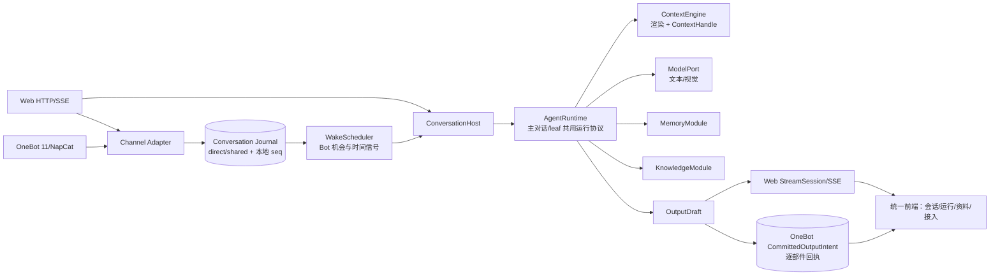

# Superstring Agent 中心化重构总计划

> 方案基线：`/Users/nkanf/clones/superstring` HEAD `d3167e4`，2026-09-25。本目录是**架构决策 + 逐文件施工与迁移验收**的完整文档集合；当前没有实施源码重构。现状事实见[业务 Wiki 首页](/Users/nkanf/docs/superstring/README.md)与[代码地图](/Users/nkanf/docs/superstring/06-代码地图与项目全貌.md)。

## 目标与边界

把 Web、OneBot 私聊、群聊和后台模型任务放进同一 `AgentRuntime` 运行协议；主对话以可迭代 Agent Loop 为中心。`WakeScheduler` 决定 Agent 何时有机会观察，Agent 决定查询/发言/目标；记忆和知识是可替换的轻量模块，不把当前分块/词项检索硬编码进架构。前端同步呈现统一会话、运行状态与诊断，同时保留现有 Agent、记忆、知识和 QQ 管理能力。**不做功能降级，不引入多余总管或重复防御检查。**

本轮只暴露未来可接工具/Skills/MCP 和上下文读取的接口，不实现外部工具、Skills、MCP 或 Agent 间上下文继承。标准模型协议/成熟适配层可在三个核心重构 PR 后另开一个独立 PR；重构内只留已可运行的 `ModelPort` 出口和 TODO。[后续扩展](./10-后续标准协议扩展.md)

## 阅读路径

| 顺序 | 文档 | 作用 |
| --- | --- | --- |
| 1 | [现状与目标架构](./01-架构决策与现状目标对照.md) | 总架构及每个子系统的现状/目标配对图、当前代码事实。 |
| 2 | [Agent 运行与上下文](./02-Agent运行与上下文协议.md) | AgentSpec、行动协议、leaf 任务、流式与 ContextHandle。 |
| 3 | [会话与唤醒](./03-会话与唤醒调度.md) | direct/shared、OneBot 适配、持久机会、本地序列、串行与重试。 |
| 4 | [记忆与知识](./04-记忆与知识模块.md) | 可选摄入/维护能力、统一证据、现有策略无降级。 |
| 5 | [投递与恢复](./05-投递与恢复状态机.md) | Web StreamSession、OneBot 逐部件意图、unknown/stale。 |
| 6 | [设计决策记录](./06-设计决策记录.md) | 用户已定方向与本轮工程选择及其现状、方案、预期。 |
| 7 | [逐文件实施计划](./07-逐文件实施计划.md) | 目标目录树、具体新增/修改/删除文件及 3 PR 拆法。 |
| 8 | [迁移与验收](./08-迁移与验收.md) | 数据结构、回填、回滚、行为矩阵和测试门槛。 |
| 9 | [前端体验与架构](./09-前端体验与架构.md) | 独立 UI/UX 审查、信息架构、状态合同和页面迁移。 |
| 10 | [后续标准协议扩展](./10-后续标准协议扩展.md) | 重构外独立可选 PR，评估成熟模型适配实现。 |
| 11 | [独立评审与修订](./11-独立评审与修订.md) | 两位独立子代理的发现、处理与尚需在实施中验证的证据。 |

## 一张图看目标

代码交付仍为**3 个核心 PR**：① AgentRuntime、上下文与资料边界；② Web/OneBot 私聊的 direct 会话、SSE 与出站基础；③ shared 群聊与旧固定链收束。每个 PR 包含前端适配和相应迁移/回归。标准模型接口接成熟库是**重构之外**的可选后续 PR，不阻塞这三个 PR，也不被当成第四个清理 PR。
